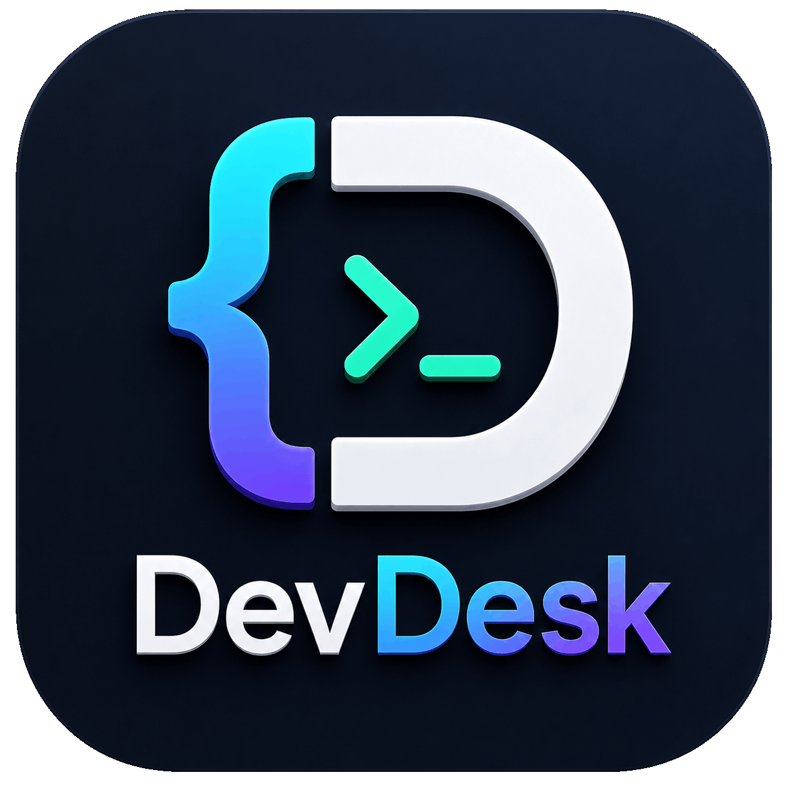
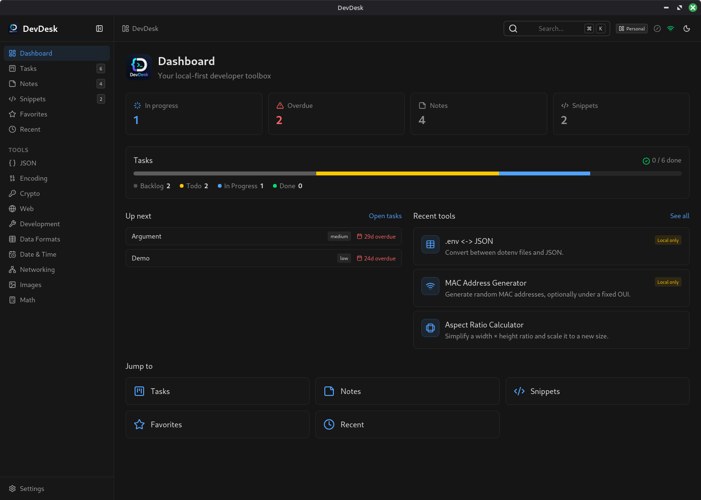

<p align="center">
  
</p>

<h1 align="center">DevDesk</h1>

<p align="center">
  <b>A local-first, privacy-first developer toolbox for the desktop.</b><br />
  73 tools across 10 categories — plus tasks, notes and snippets. Fully offline, no account, no telemetry.
</p>

<p align="center">
  <a href="https://github.com/m-elbably/devdesk/releases/latest"></a>
  <a href="https://github.com/m-elbably/devdesk/actions/workflows/release.yml"></a>
  
  
  
</p>

<p align="center">
  <a href="#install">Install</a> ·
  <a href="#the-toolbox">Tools</a> ·
  <a href="#architecture">Architecture</a> ·
  <a href="#development">Development</a> ·
  <a href="docs/adding-a-tool.md">Add a tool</a> ·
  <a href="docs/self-hosting.md">Self-hosting sync</a> ·
  <a href="docs/ai.md">AI assistant</a> ·
  <a href="docs/mcp.md">MCP server</a>
</p>

<p align="center">
  
</p>

## Why DevDesk

- **Nothing leaves your machine.** Every tool runs locally; data lives in IndexedDB. No network call is made unless you turn on sync or configure an AI provider — and the AI providers DevDesk sets up for you are ones running on your own machine.
- **Privacy is enforced, not promised.** Each tool declares a privacy level — `PUBLIC`, `LOCAL_ONLY` or `NEVER_PERSIST`. A `NEVER_PERSIST` tool (JWT parser, encryption) can't write history to disk even if it wanted to. The same levels decide what an AI model may touch: a local model gets the whole toolbox, a cloud model only the tools that cannot leak a secret.
- **One window instead of thirty tabs.** JSON, crypto, networking, images, dates and more, next to the tasks, notes and snippets that go with them.
- **Sync only if you want it.** Optional, self-hosted, one Cloudflare Worker + D1 — free tier is plenty. There is no hosted DevDesk server.
- **Genuinely extensible.** A tool is a pure function plus one metadata entry — the UI is generated. See [adding a tool](docs/adding-a-tool.md).
- **An assistant that doesn't guess.** Ask in plain English; the model picks the tool and DevDesk runs the real implementation. No hallucinated CIDR maths. See [AI assistant](docs/ai.md).

## Install

Download the executable for your OS from the [latest release](https://github.com/m-elbably/devdesk/releases/latest) and run it — a single self-contained file, no installer, no runtime to set up.

| Platform | Asset |
| --- | --- |
| macOS | `devdesk-mac_universal` |
| Windows | `devdesk-win_x64.exe` |
| Linux | `devdesk-linux_x64` |

On macOS/Linux, mark it executable first: `chmod +x devdesk-*`.

Or build it yourself — see [Development](#development).

## The toolbox

<table>
<tr><td><b>JSON</b> (3)</td><td>JSON Editor · JSON Diff · JSON → TypeScript</td></tr>
<tr><td><b>Data formats</b> (5)</td><td>JSON ⇄ YAML · JSON ⇄ CSV · JSON ⇄ JSON Lines · XML ⇄ JSON · .env ⇄ JSON</td></tr>
<tr><td><b>Encoding</b> (6)</td><td>Base64 · URL Encoder · HTML Escape · Hex / Binary · Unicode Inspector · Escape for Code</td></tr>
<tr><td><b>Crypto</b> (14)</td><td>UUID / ULID / Token / Password generators · Password Strength · RSA Key Pair · Hash · HMAC · TOTP / HOTP · Encrypt / Decrypt · JWT Parser · JWT Signer · Certificate Inspector · UUID Inspector</td></tr>
<tr><td><b>Web</b> (8)</td><td>URL Parser · Basic Auth · Slugify · User-Agent Parser · HTTP Status Codes · cURL Converter · Cookie Inspector · Cache-Control Explainer</td></tr>
<tr><td><b>Networking</b> (8)</td><td>CIDR Calculator · IP Converter · Subnet Splitter · IP Range ⇄ CIDR · IP / CIDR Matcher · MAC Generator · MAC Inspector · Port Reference</td></tr>
<tr><td><b>Development</b> (7)</td><td>Regex Tester · Cron Generator · Random Port · Git Cheatsheet · Email Normalizer · Case Converter · Chmod Calculator</td></tr>
<tr><td><b>Date & time</b> (5)</td><td>Timestamp Converter · Time Zone Converter · Duration Calculator · Date Calculator · ISO 8601 Duration</td></tr>
<tr><td><b>Images & color</b> (9)</td><td>QR Code · WiFi QR · SVG Placeholder · Color Converter · Palette Generator · Contrast Checker · Gradient Generator · Image Converter · SVG Optimizer</td></tr>
<tr><td><b>Math</b> (8)</td><td>Percentage · ETA · Byte Converter · Number Statistics · Uptime / SLA · Number Base · Aspect Ratio · Transfer Time</td></tr>
</table>

## Architecture

DevDesk is a **plugin platform**, not a set of pages. The boundaries that matter:

- **Tools are pure functions.** `packages/tools` exports each tool's `{ metadata, schema, run }` with zero UI. The desktop app renders them generically (`ToolRunner` + a small `TOOL_UI` spec), so a new tool is *logic + one metadata entry* — no bespoke component required.
- **Data flows one way:** `Vue → Services → Repositories → Dexie`. Components never touch the database.
- **Native access is isolated:** `Vue → DesktopService → NeutralinoAdapter`, with a `WebAdapter` fallback so the exact same app runs in a browser.
- **Features are decoupled** through a typed event bus (`src/lib/events.ts`). A mutation emits `entity:mutated`; the sync queue and the UI react independently.
- **Privacy levels drive behaviour automatically** — history, favourites and snippets are switched on or off by the tool's declared level, not by hand.

### Monorepo layout

```
apps/
  desktop/     Vue 3 + Vite + Tailwind + Nuxt UI + TanStack Router. Neutralino shell.
  sync-api/    Hono worker on Cloudflare Workers + D1. Auth + sync endpoints.
  mcp-server/  The toolbox over MCP stdio, for external agents.
packages/
  shared/      Types, Zod schemas, constants (the contract everything shares).
  tools/       Pure, headless tool logic + the plugin registry. No Vue, no DOM.
  database/    Dexie schema + repositories (local persistence).
  sync/        Framework-independent sync engine + API client.
  ai/          Providers, transports, and the tool privacy gate. No Vue, no DOM.
  ui/          Reusable Vue components (dialogs, feedback, badges).
  utils/       Small framework-independent helpers.
```

### Workspaces

Tasks, notes and snippets belong to a workspace. Exactly one is active at a time; the repository
layer stamps new records with it and scopes every listing to it, so nothing has to pass a workspace
id around. The active workspace is shown in the app header and managed in **Settings → Workspaces**.
Switching reloads the window — the simplest way to guarantee every open view re-reads the new scope.

The first run creates a `Personal` workspace (id `default`). The choice is stored per-install in
`localStorage`; if it points at a workspace that no longer exists, the app falls back to `default`.

### AI model

Optional and off until configured. Providers are stored in a local-only table that sync never sees,
and API keys are stripped from database backups. Whether a provider is local is derived from its URL,
never from what its config claims, and it fails closed — anything not provably on this machine counts
as remote, and a remote model is only ever offered `PUBLIC` tools.

The model chooses the tool and its arguments; the tool computes the answer. See [docs/ai.md](docs/ai.md),
and [docs/mcp.md](docs/mcp.md) for pointing an external agent at the same toolbox.

### Sync model

Local-first, last-write-wins (v1). Every mutation is saved locally, queued, and pushed in the
background; the client pulls remote changes and merges them by `updatedAt`. Soft deletes sync as
tombstones. See `packages/sync/src/engine.ts` and [docs/self-hosting.md](docs/self-hosting.md) to run
the server side yourself.

## Development

Requires **Node ≥ 20** and **pnpm**.

```bash
pnpm install

pnpm dev            # sync API + desktop app together
pnpm dev:desktop    # desktop app only (Vite dev server, http://localhost:5173)
pnpm dev:api        # sync API only (wrangler dev, http://localhost:8787)

pnpm test           # all packages
pnpm typecheck      # all packages
pnpm lint
```

### Desktop packaging (Neutralino)

```bash
pnpm --filter @devdesk/desktop build     # build web assets into dist/
pnpm --filter @devdesk/desktop neu:run   # run the native window (needs neu CLI)
pnpm --filter @devdesk/desktop neu:build # produce release binaries
```

Tagging a `v*` release pushes the cross-platform binaries to GitHub Releases automatically
(`.github/workflows/release.yml`).

### Testing

Vitest across every layer: tool logic, utils, repositories (fake-indexeddb), services, the sync
engine, Vue components (@vue/test-utils), and the worker's routing/auth.

## Contributing

Contributions are welcome — new tools especially. Start with
[docs/adding-a-tool.md](docs/adding-a-tool.md); a tool is a pure function and a catalog entry, and
the UI comes for free. Before opening a PR, run `pnpm test`, `pnpm typecheck` and `pnpm lint`.
For anything larger, open an issue first so we can agree on the shape.
