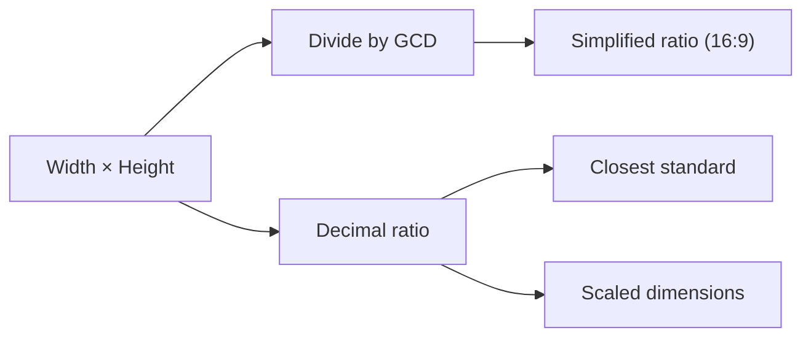

# Aspect Ratio Calculator

Simplifies a width × height into its ratio, names the standard it's closest to, and works out the matching side when you scale to a new size — with the frame drawn so you can see what you're describing.

## How It Works

The simplified ratio is the width and height divided by their greatest common divisor — `1920×1080` and `1280×720` both reduce to `16:9`, which is the point.

## Common Ratios

| Ratio | Decimal | Typical use |
|-------|---------|-------------|
| 16:9 | 1.778 | HD/4K video, most monitors and TVs |
| 4:3 | 1.333 | Older displays, iPad, many camera sensors |
| 3:2 | 1.500 | 35mm photography, Surface devices |
| 16:10 | 1.600 | Many laptops, productivity displays |
| 21:9 | 2.333 | Ultrawide monitors |
| 2.39:1 | 2.390 | Anamorphic cinema |
| 1:1 | 1.000 | Avatars, social posts |
| 9:16 | 0.563 | Vertical video, phone screens |

## Scaling: Contain vs Cover

Fill both scale fields and you get the two rules that matter, the same ones CSS `object-fit` implements:

- **Contain** — scale until the whole image fits inside the box. Nothing is cropped; empty space (letterboxing) may remain.
- **Cover** — scale until the box is completely filled. Nothing is empty; the overflow is cropped.

Filling only one field gives the classic "I know the width I want, what's the height?" answer that preserves the ratio exactly.

## Best Practices

- **Scale by ratio, never by eye.** A 1-pixel rounding error compounds across a responsive image set.
- **Round to even numbers for video.** Most codecs require even dimensions, and some require multiples of 4 or 16.
- **Pick target sizes on the same ratio** as the source, or decide up front whether cropping (cover) or letterboxing (contain) is acceptable — that's a design decision, not a maths one.
- **Watch device pixel ratio.** A 400×225 CSS box needs an 800×450 asset on a 2× display.

## Tips & Hints

- The drawn frame shows the original in solid and the scaled result as a dashed outline, anchored at the same corner — so growth and shrinkage read as a change, not two unrelated boxes.
- "Closest standard" says *(exact)* only when the ratio matches to within 0.001; otherwise it's the nearest one, which is usually a hint that a crop is coming.
- Megapixels is width × height ÷ 1,000,000 — handy for sanity-checking upload limits.
- Non-integer inputs are accepted and rounded for the simplified ratio only; the decimal ratio uses the exact values.
