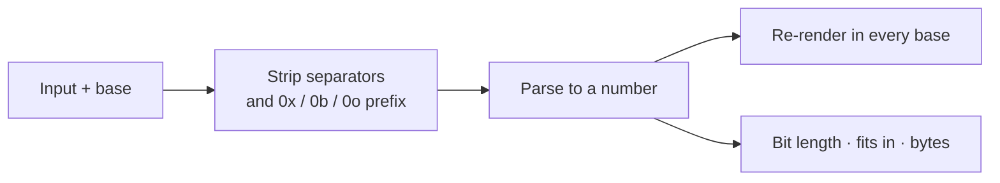

# Number Base Converter

Convert a single number between binary, octal, decimal, hexadecimal and base 36 — with its bit length, byte layout, and the smallest integer type that holds it.

## How It Works

With **auto** the base comes from the prefix: `0x` → hex, `0b` → binary, `0o` → octal, otherwise decimal. Pick a base explicitly when the input has no prefix — `1010` is ten in decimal and ten *bits* worth of something else in binary, and only you know which you meant.

## Bases at a Glance

| Base | Prefix | Digits | Where you meet it |
|------|--------|--------|-------------------|
| 2 | `0b` | 0–1 | Bit flags, masks, permissions |
| 8 | `0o` | 0–7 | Unix file modes (`chmod 755`) |
| 10 | — | 0–9 | Everything else |
| 16 | `0x` | 0–9, A–F | Memory addresses, colors, hashes, bytes |
| 36 | — | 0–9, A–Z | Short ids — the most compact case-insensitive form |

One hex digit is exactly four bits, which is why hex reads so well for byte data: two digits per byte, always.

## Reading the Output

- **Binary** is grouped in nibbles (`0b1111 1111`) — counting a 16-bit mask off an unbroken run of digits is how off-by-one bugs happen.
- **Bit length** is the number of significant bits, ignoring leading zeros.
- **Fits in** names the smallest unsigned type that holds the value — useful when picking a column type or a struct field.
- **Bytes** shows the value zero-padded to whole bytes, as you'd see it in a hex dump.

## Best Practices

- **Be explicit about width in code.** `0xFF` is 255 in any language, but whether it fits depends on the type you're assigning it to, not on the literal.
- **Mind signedness.** This tool treats the digits as a magnitude and shows a leading `-` for negatives. Two's-complement representation (where −1 is `0xFFFFFFFF` in 32 bits) is a *type* decision, not a base conversion.
- **Don't hand-convert masks.** Reading `0b0000_1000` as "bit 3" from the grouped output beats counting characters.

## Tips & Hints

- Spaces, commas and underscores are ignored: `1010 1100`, `1_000_000` and `0xDE,AD` all parse.
- Integers only. Above 2^53 JavaScript numbers lose precision, and the "Fits in" row says so rather than pretending.
- For converting *text* to hex or binary bytes, use the Hex / Binary Converter in Encoding — that one is about characters, this one is about a single number.
