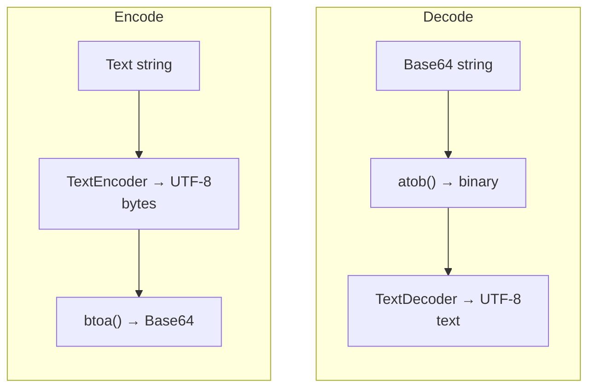

# Base64

Encodes text to Base64 and decodes Base64 back to text. Unicode-safe — handles multi-byte characters (emoji, accents, CJK) correctly via UTF-8.

## How It Works

A naive `btoa(text)` fails on characters outside Latin-1. This tool routes through `TextEncoder`/`TextDecoder` so the full Unicode range is handled — emoji, accented characters, and CJK all encode and decode round-trip cleanly.

### Base64 alphabets

| Variant | Alphabet | Use for |
|---------|----------|---------|
| `standard` | `A-Za-z0-9+/` | Data URIs, MIME, HTTP headers |
| `url-safe` | `A-Za-z0-9-_` | URLs, filenames, JWTs — `+` and `/` are unsafe in both |

Every 3 bytes of input become 4 characters of output, with `=` padding at the end. Padding is optional in the URL-safe variant (JWTs omit it), which is what the **Padding** toggle controls.

**Decoding ignores all of this.** It accepts either alphabet, with or without padding, and strips line breaks first — so a value pasted from anywhere just works, rather than making you first identify which flavour you were handed.

## Best Practices

- **Base64 is not encryption** — it's an encoding. Anyone can decode it. Never use it to protect sensitive data.
- **Use Base64** for embedding binary data in text contexts (data URIs, JSON payloads, email attachments).
- **Base64 inflates size by ~33%** — don't use it for storage when you can store raw bytes instead. The char/byte counts on each panel show the real cost.
- **Use `url-safe` for anything that lands in a URL or filename** — a `/` in a path or a `+` in a query string will be misread.

## Tips & Hints

- Base64 strings end with `=` or `==` padding (or nothing if the input length is a multiple of 3, or if padding was stripped).
- If decoding produces garbled text rather than an error, the input was probably Latin-1 rather than UTF-8.
- **Swap** feeds the output back into the input with the mode flipped — encode, then swap, to confirm a clean round-trip.
