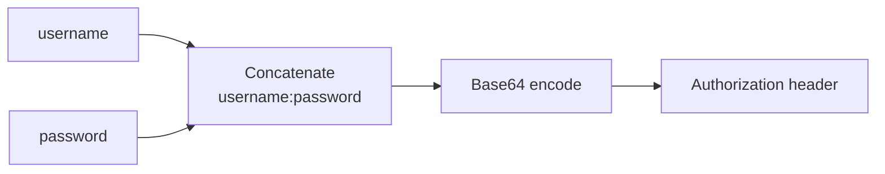

# Basic Auth Generator

Builds a Basic `Authorization` header from a username and password. The credentials are Base64-encoded and formatted as an HTTP header, ready to paste into a request.

## How It Works



The Basic Auth scheme (RFC 7617) sends credentials as `username:password` Base64-encoded in the `Authorization` header:

```
Authorization: Basic dXNlcjpwYXNz
```

where `dXNlcjpwYXNz` is `base64("user:pass")`.

## Best Practices

- **Basic Auth is not secure over plain HTTP.** Always use it over HTTPS — the credentials are only Base64-encoded, not encrypted, and can be trivially decoded by anyone who intercepts the request.
- **Don't hardcode Basic Auth headers** in client-side code. Use environment variables or a secrets manager for production.
- **Prefer bearer tokens** (OAuth, API keys) for modern APIs. Basic Auth sends credentials on every request, increasing exposure.
- **Special characters in credentials** (like `:`) affect parsing. The colon is the delimiter — a password containing `:` will still work because the spec splits on the first colon only.

## Tips & Hints

- This tool runs **entirely in your browser** — credentials never leave your machine.
- **Decode mode** reverses the process: paste a whole `Authorization: Basic …` line (or just the token) to recover the username and password. Useful when auditing a config file, a `.netrc`, or a captured request.
- Output rows copy on click — the full header line, the bare token, and a ready-to-run `curl -u` command.
- To test with `curl`, use: `curl -H "Authorization: Basic <token>" <url>` or the shorthand `curl -u user:pass <url>`.
- Base64 is reversible — anyone with the token can decode the credentials. Treat the header as sensitive as the password itself.
