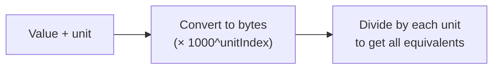

# Byte Converter

Converts between byte units — B, KB, MB, GB, TB, PB — in either SI (base-1000) or IEC (base-1024). Enter a value and unit, and get the equivalent in all units instantly, plus the human-readable form in *both* systems so the discrepancy is on screen rather than in your head.

## How It Works

The tool converts the input to bytes first, then divides by each unit's factor to produce all equivalents. Results are rounded to 4 decimal places.

### SI (base-1000) units

| Unit | Factor | Bytes |
|------|--------|-------|
| B | 1 | 1 |
| KB | 1,000 | 10³ |
| MB | 1,000,000 | 10⁶ |
| GB | 10⁹ | 1,000,000,000 |
| TB | 10¹² | 1,000,000,000,000 |
| PB | 10¹⁵ | 1,000,000,000,000,000 |

## SI vs Binary (the common confusion)

There are two competing unit systems:

| System | Base | KB = | MB = | Use case |
|--------|------|------|------|----------|
| **SI** (decimal) | 1000 | 1,000 B | 1,000,000 B | Storage (SSDs, HDDs), networking |
| **Binary** (IEC) | 1024 | 1,024 B (KiB) | 1,048,576 B (MiB) | Memory (RAM), file sizes (historically) |

The **Base** control switches between the two, and the conversion rows relabel with it (KB/MB/GB for SI, KiB/MiB/GiB for IEC). The default is SI, matching how storage manufacturers label drives. A "500 GB" SSD has 500 × 10⁹ bytes. Windows historically displays sizes in binary units but labels them as KB/MB/GB (not KiB/MiB/GiB), which is why a "500 GB" drive shows as ~465 GB in Windows Explorer.

## Best Practices

- **Know which system you're using** — SI (1000) for storage and networking, binary (1024) for memory. Mixing them causes confusion.
- **Use the IEC suffixes** (KiB, MiB, GiB) when you mean binary — it eliminates ambiguity. Switch the Base control to IEC and the labels follow.
- **Be aware of the discrepancy** — 1 MB (SI) = 0.954 MiB (binary). For large values the gap is significant: 1 TB (SI) ≈ 0.909 TiB.

## Tips & Hints

- Results are rounded to 4 decimal places — very large or very small values may show as `0` due to rounding.
- The tool is bidirectional — enter in any unit and see all others.
- For networking, use SI units (1 Mbps = 1,000,000 bits/s). For RAM, use binary (1 GB RAM = 1,073,741,824 bytes).
- There's no exabyte (EB) unit here, but if you need it: 1 EB = 1000 PB = 10¹⁸ bytes.
