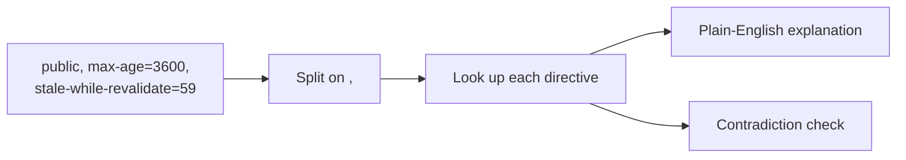

# Cache-Control Explainer

Reads a `Cache-Control` header and says, directive by directive, what it tells browsers and shared caches (CDNs, proxies) to do — with durations in human units instead of raw seconds.

## How It Works

### Freshness

| Directive | Meaning |
|-----------|---------|
| `max-age=N` | Fresh for N seconds. After that, revalidate before reuse. |
| `s-maxage=N` | Same, but for shared caches only — and it overrides `max-age` for them. |
| `stale-while-revalidate=N` | For N seconds past expiry, serve the stale copy *and* refresh in the background. The user waits for nothing. |
| `stale-if-error=N` | If the origin is erroring, keep serving the stale copy for N seconds. |

### Storage

| Directive | Meaning |
|-----------|---------|
| `public` | Any cache may store it, including CDNs — even for authenticated requests. |
| `private` | Browser only. Shared caches must not store it. |
| `no-store` | Never stored anywhere. For responses with personal or secret data. |
| `immutable` | The body will not change while fresh, so browsers skip revalidation on reload. |

### Revalidation

| Directive | Meaning |
|-----------|---------|
| `no-cache` | **Store it, but never reuse it without asking the origin first.** Not the same as `no-store`. |
| `must-revalidate` | Once stale, serving the stale copy is forbidden — even offline. |
| `proxy-revalidate` | The same, for shared caches only. |

## Best Practices

- **`no-cache` ≠ `no-store`.** `no-cache` means "revalidate every time"; `no-store` means "never write this down". Reaching for `no-cache` to protect secrets is a common and costly mistake — use `no-store`.
- **Hash your asset filenames and cache them hard:** `public, max-age=31536000, immutable`. A new build produces a new URL, so the old one never needs invalidating.
- **For HTML, prefer `no-cache` over a short `max-age`.** Revalidation is cheap — a `304` is a header exchange — and it means users never sit on a stale page for the length of a timer you can't cancel.
- **`stale-while-revalidate` is close to free latency.** A small window (30–60s) absorbs traffic spikes without ever showing a user a loading state.
- **Authenticated responses need `private`** (or `no-store`), or a shared cache may serve one user's response to another.

## Tips & Hints

- Rows starting with **⚠** flag directives that contradict each other — `no-store` alongside `max-age`, or `public` alongside `private`.
- `immutable` without a `max-age` does nothing: there's no freshness window for it to apply to.
- Unknown directives are reported but harmless — caches ignore anything they don't recognise, which is what makes new directives safe to deploy.
- `Cache-Control` overrides the older `Expires` header wherever both are present.
- Paste the whole header line (`Cache-Control: …`) or just the value; both work.
