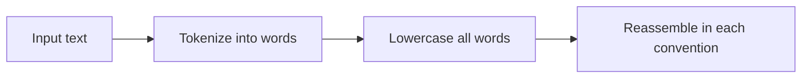

# Case Converter

Converts text between common naming conventions used in programming. Paste any text and instantly see it in camelCase, PascalCase, snake_case, kebab-case, CONSTANT_CASE, and Title Case.

## How It Works

The converter first splits the input into words by:
1. Inserting a space at camelCase/PascalCase boundaries (`myVar` → `my Var`)
2. Splitting on any non-alphanumeric character (spaces, hyphens, underscores, dots)

Then it lowercases all words and reassembles them according to each convention's rules.

### Conventions

| Convention | Example | Used for |
|-----------|---------|----------|
| camelCase | `myVariableName` | JavaScript/TypeScript variables, Java methods |
| PascalCase | `MyClassName` | Classes, types, React components, C# interfaces |
| snake_case | `my_variable` | Python, Rust, Ruby, database columns |
| kebab-case | `my-css-class` | CSS classes, HTML attributes, URLs |
| CONSTANT_CASE | `MY_CONSTANT` | Constants, environment variables, enums |
| Title Case | `My Variable Name` | Headings, display text |

## Best Practices

- **Follow your language's convention** — consistency within a codebase matters more than any individual style choice.
- **Use the right convention for the context:**
  - Variables/functions → camelCase (JS/TS, Java)
  - Types/classes → PascalCase (most languages)
  - Constants → CONSTANT_CASE (most languages)
  - CSS/HTML → kebab-case
  - Python/Rust → snake_case for everything
- **Don't mix conventions** in the same scope — `getUserName` and `fetch_user_data` in the same file looks sloppy.

## Tips & Hints

- The converter handles mixed input: `"PascalCase-snake_case mixed"` tokenizes correctly into `["pascal", "case", "snake", "case", "mixed"]`.
- Numbers are treated as part of words: `v2Response` → `v2_response` in snake_case.
- Consecutive separators collapse: `foo__bar` → `foo_bar` (not `foo__bar`).
- Acronyms are lowercased: `parseXML` → `parse_xml`, not `parse_XML`. If you need to preserve acronyms, you'll have to adjust manually.
