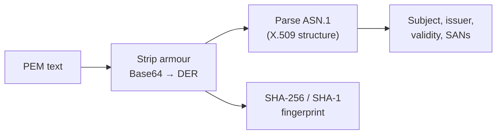

# Certificate Inspector

Reads an X.509 certificate in PEM form and shows what's inside it — who it identifies, who issued it, how long it's good for, which hostnames it covers, and its fingerprints.

This is the browser-side equivalent of:

```
openssl x509 -in cert.pem -noout -text
```

## How It Works

A PEM certificate is Base64-encoded DER (binary ASN.1) wrapped in header and footer lines:

```
-----BEGIN CERTIFICATE-----
MIIDhDCCAmygAwIBAgIU...
-----END CERTIFICATE-----
```



The fingerprint is a hash of the **original DER bytes**, so it matches what `openssl x509 -fingerprint -sha256` and your browser's certificate viewer report.

### What the fields mean

| Field | Meaning |
|-------|---------|
| Subject | Who the certificate identifies (`CN` is the primary name) |
| Issuer | The CA that signed it — same as Subject when self-signed |
| Valid from / to | The window in which the certificate is accepted |
| Serial number | The issuer's unique ID for this certificate |
| Signature algorithm | How the CA signed it (e.g. `sha256WithRSAEncryption`) |
| Subject alternative names | The hostnames/IPs the certificate actually covers |
| Certificate authority | Whether this cert may sign other certs |
| Fingerprint | Hash of the whole certificate — used for pinning and comparison |

## Best Practices

- **SANs are what browsers check, not `CN`.** A certificate whose `CN` is `example.com` but whose SAN list omits it will be rejected by every modern browser.
- **Compare fingerprints, not subjects,** when you need to confirm two systems are using the same certificate — subjects are not unique.
- **Watch the expiry.** Most outages blamed on "SSL problems" are an expired certificate nobody renewed.
- **Use SHA-256 fingerprints.** SHA-1 is shown for matching against older tooling that still prints it, not because it's trustworthy.

## Tips & Hints

- This tool runs **entirely in your browser** — the certificate is never uploaded, and nothing is written to history.
- It **inspects, it does not validate**: no signature check, no chain building, no revocation (CRL/OCSP) lookup. A certificate shown here as "Valid" may still be rejected by a client.
- Pasting a `fullchain.pem` works — the leaf (first) certificate is shown, and a `Chain` row tells you how many blocks were found.
- To fetch a live certificate to paste here: `openssl s_client -connect example.com:443 -servername example.com </dev/null | openssl x509`
- A `.crt` or `.cer` file that opens as readable text is already PEM. If it's binary DER, convert it first: `openssl x509 -inform der -in cert.der`
