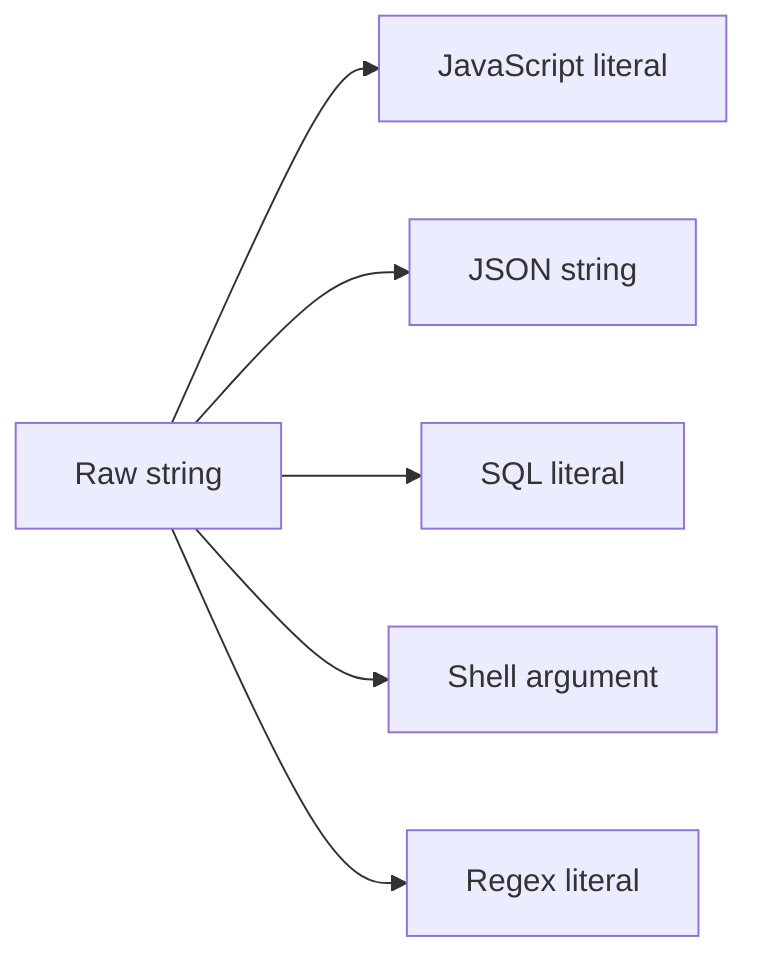

# Escape for Code

Escapes a string so it can be safely embedded as a literal in JavaScript, JSON, SQL, a POSIX shell, or a regular expression. One input, every context at once — you rarely know up front which one you need, and comparing them is often the point.

## How It Works

Each target has different metacharacters, so the same input produces genuinely different output — an escape that's correct for one context can be useless or actively dangerous in another.

### What each target escapes

| Target | Rule |
|--------|------|
| JavaScript | Backslash, the matching quote, and control characters as `\n`, `\t`, … |
| JSON | Per RFC 8259, via `JSON.stringify` |
| SQL | A single quote is doubled (`''`) — the one escape every dialect agrees on |
| Shell (POSIX) | Wrapped in single quotes; a literal quote becomes `'"'"'` |
| Regex | Every character with special meaning is backslash-escaped, so the result matches literally |

## Best Practices

- **Escaping is a last resort, not a strategy.** Parameterised queries (`WHERE id = ?`) and argument arrays (`execFile(cmd, [args])`) avoid the problem entirely instead of papering over it. Reach for those first.
- **Never build SQL by concatenating escaped strings** if a placeholder is available. Escaping is for the cases where you genuinely can't parameterise — a literal in a migration file, say.
- **Match the escape to the context you're actually in.** A JSON-escaped string pasted into a shell command is still a shell injection.
- **Don't escape twice.** Running output through a second pass produces `\\n` where you wanted `\n`.

## Tips & Hints

- The shell target uses single quotes because they make a POSIX shell treat everything literally — no variable expansion, no command substitution, no backslash processing.
- `'"'"'` looks bizarre but is the standard idiom: close the quote, add an escaped quote, reopen. It's what `printf %q` produces too.
- The SQL target deliberately avoids backslash escaping — that's MySQL-specific and depends on the server's `NO_BACKSLASH_ESCAPES` mode, so it isn't portable.
- The regex output escapes `-` as well, which matters only inside a character class but is harmless outside one.
