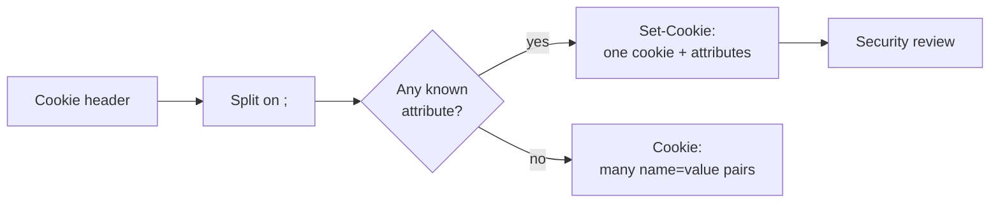

# Cookie Inspector

Breaks a cookie header into its parts and reviews its security flags. Works in both directions: a `Set-Cookie` response header (one cookie plus attributes) or a `Cookie` request header (many `name=value` pairs).

## How It Works

Which header you pasted is detected, not asked: if any segment after the first is a known cookie attribute (`Path`, `Secure`, `SameSite`, …), it's a `Set-Cookie`. Otherwise every segment is a name/value pair. A leading `Set-Cookie:` or `Cookie:` label is stripped either way.

### Attributes

| Attribute | Meaning |
|-----------|---------|
| `Domain` | Which hosts receive the cookie. Omitting it is *stricter* — the cookie goes to the exact origin only. |
| `Path` | URL prefix the cookie applies to. Defaults to `/`. |
| `Expires` | Absolute expiry date. Shown as ISO plus how far away it is. |
| `Max-Age` | Lifetime in seconds. **Takes precedence over `Expires`** where both appear. |
| `SameSite` | `Strict`, `Lax`, or `None` — controls whether the cookie rides along on cross-site requests. |
| `Secure` | HTTPS only. |
| `HttpOnly` | Hidden from `document.cookie`. |
| `Partitioned` | Isolates the cookie per top-level site (CHIPS). |

A cookie with neither `Expires` nor `Max-Age` is a **session cookie** — gone when the browser closes.

## Best Practices

- **`Secure` + `HttpOnly` + `SameSite` on every session cookie.** Missing `HttpOnly` means an XSS bug is enough to steal the session; missing `Secure` means a plain-HTTP request leaks it.
- **`SameSite=None` requires `Secure`.** Browsers reject the cookie outright without it — a silent, hard-to-debug failure.
- **`SameSite=Lax` is the modern default,** but set it explicitly so behaviour doesn't depend on browser version.
- **Use the `__Host-` prefix for session cookies.** It forces `Secure`, `Path=/`, and no `Domain`, so a subdomain can't overwrite the cookie. The browser enforces it — a `__Host-` cookie that breaks the rules is dropped.
- **Don't put anything sensitive in the value.** A cookie is client-side storage: readable, editable, and replayable by whoever holds it.

## Tips & Hints

- Rows starting with **⚠** are the security review: a missing flag, or two attributes that contradict each other.
- Nothing typed here is stored — this tool never writes to history.
- Cookie *values* are opaque to the browser. If yours looks like Base64 or a JWT, decode it with the Base64 or JWT tools to see what you're actually shipping to the client.
- Size matters: browsers cap cookies at roughly 4 KB, and every cookie is sent on every matching request.
