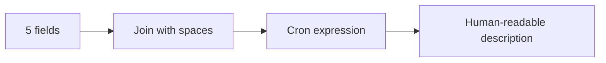

# Cron Generator

Builds and explains cron expressions from five fields. Enter values for each field and the tool assembles the expression and generates a human-readable description.

## How It Works

A cron expression has five fields, left to right:

```
┌──────── minute (0–59)
│ ┌────── hour (0–23)
│ │ ┌──── day of month (1–31)
│ │ │ ┌── month (1–12 or JAN–DEC)
│ │ │ │ ┌ day of week (0–6 or SUN–SAT)
│ │ │ │ │
* * * * *
```



### Syntax in each field

| Syntax | Meaning | Example |
|--------|---------|---------|
| `*` | Every value | `*` in minute = every minute |
| `5` | Exact value | `5` in hour = at 5 AM |
| `1,15` | List of values | `1,15` in minute = at minute 1 and 15 |
| `1-5` | Range | `1-5` in day-of-week = Monday–Friday |
| `*/15` | Step | `*/15` in minute = every 15 minutes |
| `0 */2 * * *` | Combination | Every 2 hours at minute 0 |

### Common patterns

| Expression | Meaning |
|-----------|---------|
| `* * * * *` | Every minute |
| `0 * * * *` | Every hour at minute 0 |
| `0 0 * * *` | Every day at midnight |
| `0 0 * * 0` | Every Sunday at midnight |
| `*/15 * * * *` | Every 15 minutes |
| `0 9 * * 1-5` | Weekdays at 9 AM |
| `0 0 1 * *` | First day of every month |

## Best Practices

- **Be explicit with timezones.** Cron runs in the server's timezone. If your server is UTC but your users are in EST, `0 9 * * *` runs at 4 AM EST, not 9 AM. Always document the expected timezone.
- **Avoid `@daily` / `@hourly` shortcuts** if you need fine-grained control — the five-field syntax is more flexible and portable.
- **Day-of-month and day-of-week are OR'd**, not AND'd. `0 0 1 * 1` runs on the 1st of the month *or* Monday, not "the 1st that is also a Monday." This is a common source of confusion.
- **Use `*/N` carefully** — `*/1` in minute is the same as `*`. `*/0` is undefined behavior.

## Tips & Hints

- The description generated by this tool covers common patterns but may not perfectly describe complex expressions. Always verify with your cron daemon.
- Day-of-week: `0` and `7` both mean Sunday in most implementations.
- Month and day-of-week can use names: `JAN-DEC`, `SUN-SAT` (case-insensitive in most cron implementations).
- Some systems support a sixth field (seconds) at the beginning — this tool uses the standard five-field format.
- Quartz Scheduler uses a different syntax (7 fields with seconds and year) — don't assume cross-compatibility.
