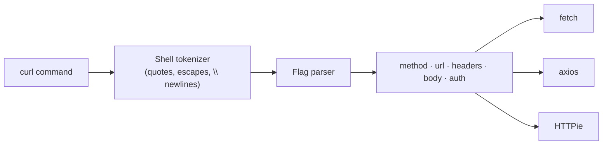

# cURL Converter

Turns a `curl` command into equivalent client code — `fetch`, `axios`, or an HTTPie command line. Nothing is sent anywhere; the command is parsed as text and rewritten.

The intended workflow: **DevTools → Network → right-click a request → Copy as cURL**, then paste it here to get code you can drop into a script or a test.

## How It Works

The tokenizer follows shell rules rather than splitting on spaces: single quotes are literal, double quotes honour `\` escapes, and a backslash before a newline continues the line. That is what lets a multi-line pasted command survive intact.

### Flags understood

| Flag | Effect |
|------|--------|
| `-X`, `--request` | HTTP method |
| `-H`, `--header` | Request header (split on the first `:`) |
| `-d`, `--data`, `--data-raw`, `--data-binary`, `--data-urlencode` | Request body; repeated flags concatenate with `&`, as curl does |
| `-u`, `--user` | Basic auth — inlined as an `Authorization` header for `fetch`, as an `auth` object for axios, as `-a` for HTTPie |
| `-A`, `--user-agent` | Sets the `User-Agent` header |
| `-b`, `--cookie` | Sets the `Cookie` header |
| `-e`, `--referer` | Sets the `Referer` header |
| `-k`, `--insecure` | Noted for HTTPie (`--verify=no`); ignored elsewhere |

### Method inference

With no `-X`, the method follows curl's own rule: `GET` normally, `POST` when a body is present.

## Best Practices

- **Check what you're pasting.** A copied cURL from DevTools carries every cookie, bearer token, and session header the real request had. The generated code carries them too — strip them before committing it.
- **Basic auth in generated code is still Base64, not encryption.** Move `-u` credentials to environment variables rather than leaving them in a literal.
- **A JSON body is re-indented into a real object literal**, so `JSON.stringify({ ... })` is readable and editable instead of a single escaped string.

## Tips & Hints

- Flags that only affect the transfer — `-o`, `-s`, `-v`, `-m`, `--compressed`, `--retry` — are dropped, because they have no equivalent in the generated code. They're consumed correctly, so they can't swallow the URL that follows.
- An unknown flag is treated as a boolean switch and skipped, rather than eating the next token.
- The URL is the first bare argument, or whatever follows `--url`.
- Unbalanced quotes are reported rather than silently mis-parsed.
