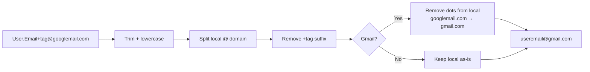

# Email Normalizer

Normalizes email addresses to a canonical form so that differently-formatted addresses belonging to the same mailbox collapse to a single identity. Useful for deduplication, analytics, and preventing multiple accounts per user.

## How It Works

### Normalization steps

1. **Trim and lowercase** the entire address
2. **Split** into local part and domain at the last `@`
3. **Remove plus-addressing** — everything from `+` to `@` is stripped (`user+tag@gmail.com` → `user@gmail.com`)
4. **Gmail special handling:**
   - Dots are removed from the local part (`u.s.e.r@gmail.com` → `user@gmail.com`)
   - `googlemail.com` is normalized to `gmail.com`

### Why Gmail is special

Gmail ignores dots in the local part — `user@gmail.com` and `u.s.e.r@gmail.com` deliver to the same inbox. It also treats `googlemail.com` as an alias for `gmail.com`. Most other providers (Outlook, Yahoo, ProtonMail) treat dots as significant.

## Best Practices

- **Normalize before deduplication** — always normalize before comparing emails to detect the same user.
- **Store both the original and normalized forms** — the original for display/emailing, the normalized for uniqueness checks.
- **Don't normalize for sending email** — some providers (not Gmail) treat `user.tag@domain.com` and `user@domain.com` as different mailboxes. Normalization is for identity, not delivery.
- **Normalize at the boundary** — apply normalization when the email enters your system (signup, login, import), not ad hoc.

## Tips & Hints

- Plus-addressing (`user+newsletter@gmail.com`) is a Gmail (and many others) feature that lets users tag incoming email. It's useful for filtering — removing it reveals the base identity.
- Not all providers support plus-addressing. Some corporate Exchange setups reject it. This tool still strips it for normalization purposes.
- The tool doesn't validate email deliverability — it only normalizes the format. Use a validation library or SMTP check if you need to verify the address exists.
- Subaddressing delimiters vary by provider: `+` (Gmail, Outlook), `-` (Yahoo), `=` (Fastmail). This tool only handles `+`.
