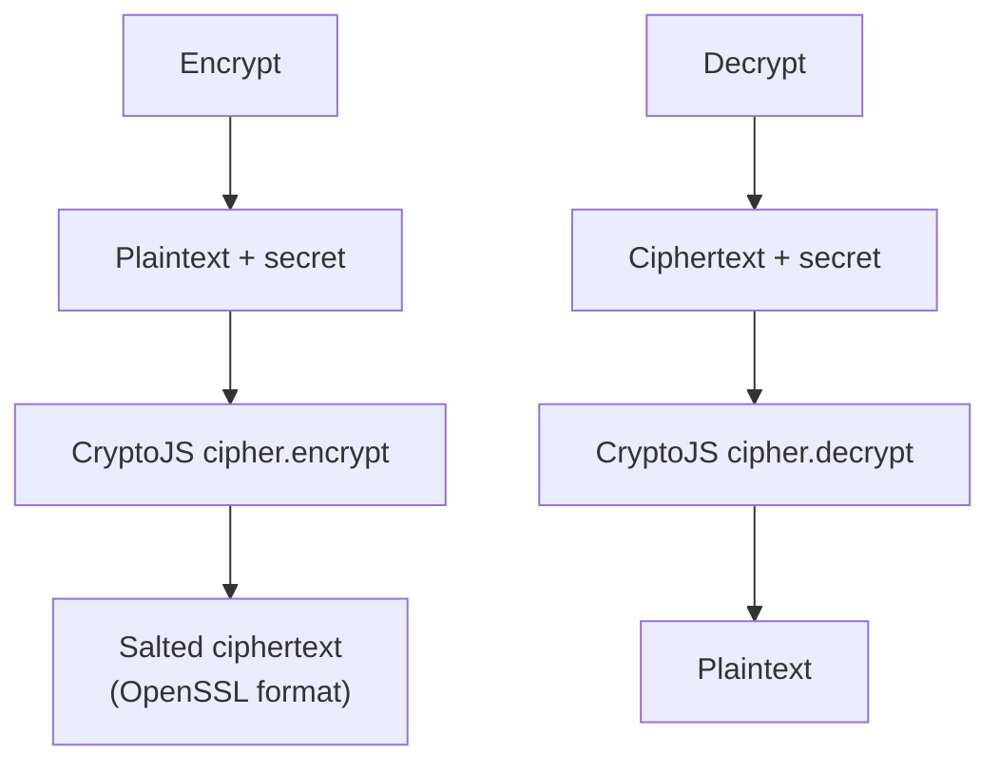

# Encrypt / Decrypt Text

Symmetric encryption and decryption of text using a passphrase. Supports AES, TripleDES, Rabbit, and RC4 via CryptoJS. The output is OpenSSL-compatible.

## How It Works

When encrypting, CryptoJS generates a random salt, derives a key from the passphrase using a KDF, and produces a salted ciphertext string. The same passphrase + ciphertext will always decrypt back to the original text — but the salt means encrypting the same text twice produces different ciphertexts.

### Algorithms

| Algorithm | Key size | Status |
|-----------|----------|--------|
| AES | 256-bit | **Recommended** — modern, secure, widely supported |
| TripleDES | 168-bit | Legacy — slower than AES, being phased out |
| Rabbit | 128-bit | Stream cipher — fast but less scrutinized |
| RC4 | variable | **Insecure** — do not use for new data |

## Best Practices

- **Always use AES** unless you have a specific reason to choose otherwise.
- **Never use RC4** — it has known critical vulnerabilities and is prohibited by RFC 7465.
- **Use a strong passphrase** — the encryption is only as strong as the secret. A short or guessable passphrase defeats any cipher.
- **This is passphrase-based encryption**, not key-based. For production systems, prefer authenticated encryption (AES-GCM) with a proper key management system.
- **Decrypting with the wrong secret** produces an empty result or an error. The tool surfaces a clear error message in this case.

## Tips & Hints

- This tool runs **entirely in your browser** — text and secrets never leave your machine.
- The ciphertext format is OpenSSL-compatible, so you can decrypt output from this tool using OpenSSL (and vice versa) with the same passphrase.
- Encrypting the same text twice produces different ciphertext because of the random salt — this is correct behavior.
- You must select the **same algorithm** for decryption that was used for encryption.
