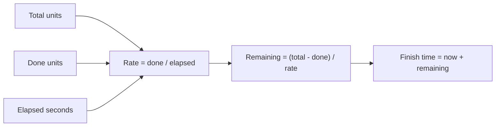

# ETA Calculator

Estimates completion time for a task based on progress so far. Enter the total work units, how many are done, and how long it took — the tool computes the rate, remaining time, and estimated finish timestamp, and draws the run as a progress bar with "now" marked on it.

## How It Works

### The calculation

1. **Rate** = `done / elapsedSeconds` (units per second)
2. **Remaining time** = `(total - done) / rate` (seconds)
3. **Finish time** = `now + remaining time` (converted to human-readable duration and a timestamp)
4. **Percent complete** = `(done / total) × 100`

The remaining time is displayed in a human-readable format (e.g., `2h 15m`), and the estimated finish time is shown as a local timestamp.

## Best Practices

- **This assumes constant rate** — the estimate is a linear extrapolation. If your task accelerates or decelerates (e.g., due to caching, fatigue, or data density), the estimate will be off.
- **Use enough elapsed time** — an ETA computed after 5 seconds of a 1-hour task will be noisy. Wait until at least 10–20% is done for a stable estimate.
- **Account for overhead** — if there's setup or teardown at the end, the real finish will be later than the estimate.
- **Set the elapsed unit rather than converting** — enter "45 minutes" directly instead of doing the ×60 in your head. Rate is still reported per second, per minute and per hour so you can quote whichever fits.

## Tips & Hints

- The bar above the table runs from when the job started to when it's projected to finish; the marker is now, and it ticks live while the page is open.

- If `done` is 0, the rate is 0 and the remaining time shows `—` (infinity) — you need at least some progress to estimate.
- The human-readable duration shows the two largest relevant units (e.g., `1d 3h`, `45m 30s`).
- The finish timestamp uses your browser's locale and timezone.
- For long-running tasks, the estimate becomes more accurate as `done` approaches `total`.
