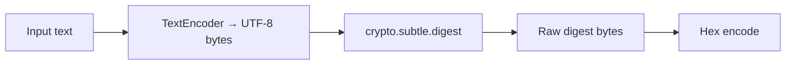

# Hash Generator

Computes cryptographic hashes of text using the Web Crypto API (`crypto.subtle.digest`). Supports SHA-1, SHA-256, SHA-384, and SHA-512.

## How It Works

The input is UTF-8 encoded, then hashed. The digest is rendered as a lowercase hex string.

| Algorithm | Output length | Hex length |
|-----------|--------------|------------|
| SHA-1 | 160 bits | 40 chars |
| SHA-256 | 256 bits | 64 chars |
| SHA-384 | 384 bits | 96 chars |
| SHA-512 | 512 bits | 128 chars |

## Best Practices

- **Use SHA-256 or SHA-512** for new applications. SHA-1 is collision-broken (SHA-1 was retired from TLS in 2017 and Git is migrating away from it).
- **Don't use raw hashes for passwords.** Hashing a password once (even with SHA-512) is vulnerable to rainbow tables and GPU brute-force. Use a dedicated password-hashing function like bcrypt, scrypt, or Argon2 instead.
- **Use HMAC** (not plain hashing) when you need to authenticate a message — a bare hash can be recomputed by anyone.
- **Hashing is one-way** — you cannot recover the original text from a hash.

## Tips & Hints

- This tool runs **entirely in your browser** — input text is never sent anywhere.
- Hashing is encoding-dependent: hashing `"café"` as UTF-8 gives a different result than Latin-1. This tool always uses UTF-8.
- SHA-256 is the sweet spot for most use cases — fast, widely supported, and secure.
- To verify file integrity, compare the hex digest character-by-character.
