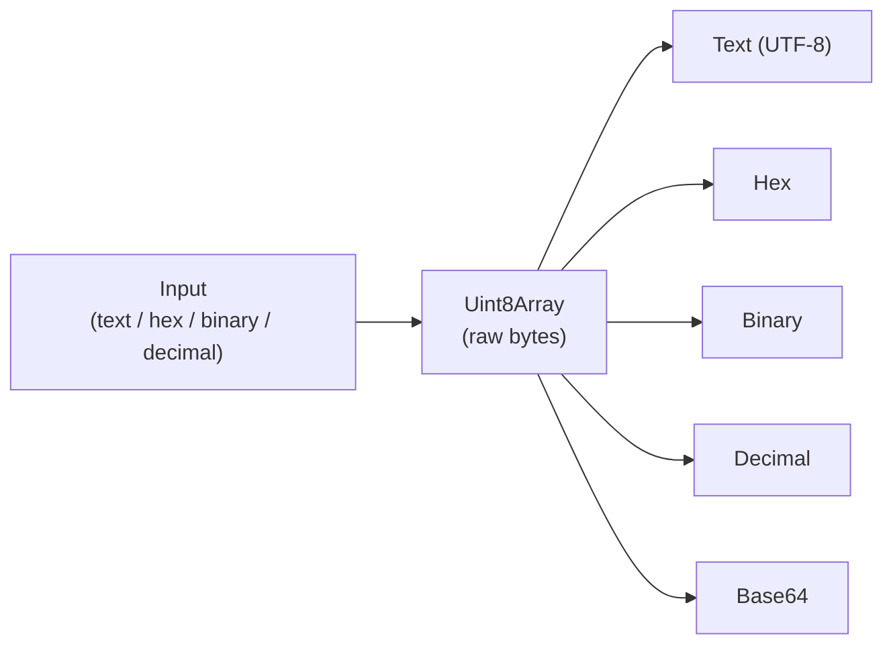

# Hex / Binary Converter

Converts between text, hexadecimal, binary, and decimal byte values. Pick what your input *is*, and every other representation comes back at once.

## How It Works

Everything routes through a raw byte array, so all four input formats that describe the same bytes produce identical output.

### Input formats

| Format | Example | Notes |
|--------|---------|-------|
| `text` | `Hi!` | Encoded as UTF-8 |
| `hex` | `48 69 21` | Two digits per byte |
| `binary` | `01001000 01101001` | Eight digits per byte |
| `decimal` | `72 105 33` | One value per byte, 0-255 |

**Separators are ignored.** `48 69 21`, `48:69:21`, `0x48,0x69,0x21`, and `486921` all read the same, so you can paste from a hex dump, a C array, or a packet capture without cleaning it up first.

## Best Practices

- **Byte count is not character count.** `é` is one character but two UTF-8 bytes; an emoji is usually four. This is the usual reason a "20 character" value overflows a `varchar(20)`.
- **Check the byte length before assuming a fixed-width format.** A 16-byte AES key must be exactly 16 bytes, not 16 characters.
- **Hex needs an even digit count and binary a multiple of eight** — a byte is 2 hex digits or 8 bits. An odd count means something got truncated.

## Tips & Hints

- Bytes that aren't valid UTF-8 report `(not valid UTF-8 text)` rather than showing replacement characters, so you can tell "this isn't text" apart from "this is text containing `�`".
- Hex is the usual format for hashes, keys, and MAC addresses; binary is most useful when you care about individual bit flags.
- To inspect what the *characters* are rather than the bytes, use the Unicode Inspector.
