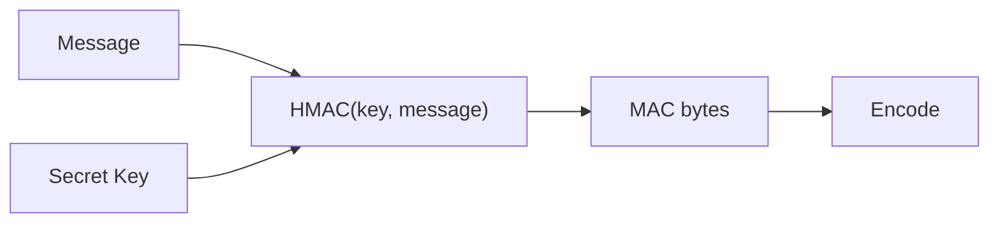

# HMAC Generator

Generate a **Hash-based Message Authentication Code (HMAC)** from a message and a secret key using **CryptoJS**. HMAC is widely used to verify the **integrity** and **authenticity** of data exchanged between systems, APIs, webhooks, authentication protocols, and signed URLs.

This tool supports the following hash algorithms:

- MD5
- SHA-1
- SHA-224
- SHA-256
- SHA-384
- SHA-512
- SHA-3 (512-bit output)

---

## How HMAC Works



Unlike a regular hash, an HMAC incorporates a **secret key** into the hashing process:

```
HMAC(K, M) = H((K ⊕ opad) || H((K ⊕ ipad) || M))
```

Where:

- **K** = secret key
- **M** = message
- **H** = selected hash function
- **ipad/opad** = predefined inner and outer padding constants

Because the secret key is part of the computation, only someone who knows the key can generate or verify a valid HMAC.

---

## Why Use HMAC?

A cryptographic hash (SHA-256, SHA-512, etc.) only guarantees that the data produces a particular digest.

Anyone can compute that digest.

HMAC adds a **shared secret**, allowing the receiver to verify that:

- The message was not modified.
- The sender possesses the shared secret.
- The message is authentic.

HMAC **does not encrypt** data. The original message remains readable; HMAC only provides authentication and integrity.

---

## Common Use Cases

HMAC is commonly used for:

- REST API request signing
- Webhook signature verification (GitHub, Stripe, Slack, etc.)
- JWT HS256/HS384/HS512 signatures
- AWS Signature Version 4
- Signed URLs
- Session tokens
- Secure cookies
- License key validation
- Message authentication between services

---

## Available Algorithms

| Algorithm | Security | Output Size | Hex Length |
|------------|----------|------------:|-----------:|
| MD5 | Legacy | 128 bits | 32 chars |
| SHA-1 | Legacy | 160 bits | 40 chars |
| SHA-224 | Good | 224 bits | 56 chars |
| SHA-256 | Recommended | 256 bits | 64 chars |
| SHA-384 | Recommended | 384 bits | 96 chars |
| SHA-512 | Recommended | 512 bits | 128 chars |
| SHA-3 | Recommended | 512 bits | 128 chars |

> For modern applications, **SHA-256** provides an excellent balance between security and performance. **SHA-512** and **SHA-3** are also excellent choices when larger MACs are acceptable.

---

## Output Encodings

The generated MAC can be displayed in several formats:

| Encoding | Description |
|-----------|-------------|
| **Binary** | Raw binary bytes. Mainly useful for low-level protocols. |
| **Hexadecimal** | Human-readable hexadecimal representation. Most common format. |
| **Base64** | Compact text representation using the Base64 alphabet. |
| **Base64URL** | URL-safe Base64 using `-` and `_` instead of `+` and `/`, with padding removed. Ideal for JWTs and URLs. |

---

## Best Practices

- Prefer **SHA-256**, **SHA-512**, or **SHA-3** for new applications.
- Avoid **MD5** and **SHA-1** for new security-sensitive systems.
- Use a **cryptographically random** secret key with sufficient entropy.
- Never embed secret keys in public client-side applications.
- Use the same algorithm, key, and encoding on both the sender and receiver.
- Compare HMAC values using **constant-time comparison** functions to reduce timing attack risks.
- Rotate secret keys periodically for long-lived systems.

---

## Security Notes

- HMAC protects **integrity** and **authenticity**, **not confidentiality**.
- Anyone can read the original message unless it is encrypted separately.
- HMAC is resistant to the collision attacks that affect plain MD5 and SHA-1 hashes because the secret key is incorporated into the computation. Nevertheless, modern applications should still use SHA-256 or stronger algorithms.
- Even a one-byte difference in the message or key results in a completely different output (the avalanche effect).

---

## Tips

- This tool runs **entirely in your browser**. Your message and secret key are never transmitted to any server.
- Text input is encoded as **UTF-8** before computing the HMAC.
- The same message, key, and algorithm always produce the same output.
- Different output encodings (Hex, Base64, Base64URL) represent the **same underlying MAC** in different textual forms.
- CryptoJS uses a **512-bit output** for SHA-3 HMAC by default.

---

## Frequently Asked Questions

### Is HMAC encryption?

No. HMAC does **not** encrypt data. It only proves that the message has not been modified and was generated by someone who knows the secret key.

### Can I recover the original message from the HMAC?

No. HMAC is a one-way cryptographic function.

### Why doesn't my HMAC match another tool?

Ensure that both tools use the same:

- hash algorithm
- secret key
- message encoding (typically UTF-8)
- output encoding (Hex, Base64, etc.)

Even a single extra space or newline changes the result.

### Should I use SHA-256 or SHA-512?

For most applications, **SHA-256** is the standard recommendation. Choose **SHA-512** or **SHA-3** if your protocol specifically requires them or if larger MACs are acceptable.
