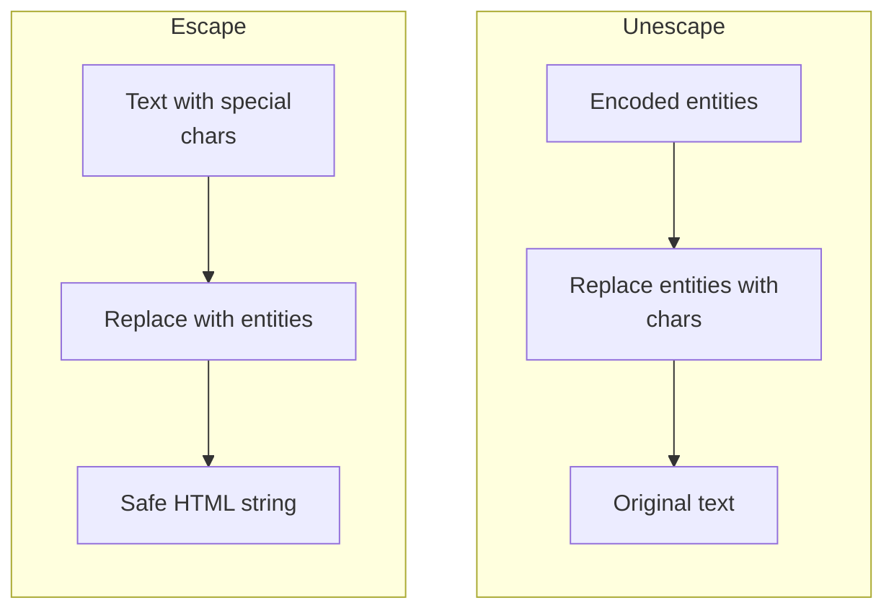

# HTML Escape

Escapes and unescapes HTML entities. Escapes the five characters that have special meaning in HTML so text can be safely inserted into HTML markup without causing parsing issues or XSS.

## How It Works

### Characters escaped

| Character | Entity |
|-----------|--------|
| `&` | `&amp;` |
| `<` | `&lt;` |
| `>` | `&gt;` |
| `"` | `&quot;` |
| `'` | `&#39;` |

These five are the minimum needed to prevent XSS when inserting text content into HTML. The `&` is escaped first to avoid corrupting existing entities during round-tripping.

### Escape modes

| Mode | Escapes |
|------|---------|
| `minimal` | The five characters above — the right default for HTML text and attribute values |
| `non-ascii` | The five above, plus every character over `U+007F` as a numeric reference (`😀` → `&#128512;`) |

Use `non-ascii` only when the transport is genuinely ASCII-only (legacy email templates, some CMS fields). Modern HTML is UTF-8 and needs no such escaping.

### Unescaping

Decoding handles any entity, not just the five this tool emits: named entities (`&nbsp;`, `&rsquo;`, `&copy;`) and both numeric forms (`&#39;` decimal, `&#x27;` hex). An unrecognised name is left as-is rather than silently dropped, so you can see what didn't decode.

## Best Practices

- **Always escape untrusted input** before inserting it into HTML. This is your first line of defense against XSS.
- **Escape in the right context.** These five entities are sufficient for HTML text content and attribute values. For JavaScript string contexts, URL contexts, or CSS contexts, you need different escaping rules.
- **Don't escape output that's already been escaped** — you'll get `&amp;amp;` instead of `&amp;`.
- **Use unescape only on trusted content** — unescaping doesn't make content safe, it just reverses the entity encoding.

## Tips & Hints

- Escaping is not the same as sanitizing. Escaping prevents text from being interpreted as markup, but sanitizing (with a library like DOMPurify) removes dangerous tags and attributes from HTML you want to render as markup.
- The apostrophe is escaped as `&#39;` (numeric entity) because `&apos;` is not supported in HTML4 — only in XHTML and XML. Decoding accepts `&apos;` regardless.
- **Swap** feeds the output back into the input with the mode flipped — a quick way to confirm a round-trip is lossless.
