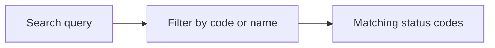

# HTTP Status Codes

A searchable reference of common HTTP response status codes, grouped by category. Type a code or keyword to filter the list.

## How It Works

Status codes are organized into five classes:

| Class | Range | Meaning |
|-------|-------|---------|
| 1xx | 100–199 | Informational — request received, continuing |
| 2xx | 200–299 | Success — request succeeded |
| 3xx | 300–399 | Redirection — further action needed |
| 4xx | 400–499 | Client error — bad request |
| 5xx | 500–599 | Server error — server failed |

### Common codes

| Code | Name | When to use |
|------|------|-------------|
| 200 | OK | Successful GET, PUT, PATCH, DELETE |
| 201 | Created | Successful POST that created a resource |
| 204 | No Content | Success with no response body (DELETE, PUT) |
| 301 | Moved Permanently | URL changed permanently (caches the redirect) |
| 302 | Found | Temporary redirect |
| 304 | Not Modified | Conditional GET — client cache is still valid |
| 400 | Bad Request | Malformed syntax, validation errors |
| 401 | Unauthorized | Missing or invalid authentication |
| 403 | Forbidden | Authenticated but not allowed |
| 404 | Not Found | Resource doesn't exist |
| 409 | Conflict | Version conflict, duplicate resource |
| 422 | Unprocessable Entity | Valid syntax but semantic errors |
| 429 | Too Many Requests | Rate limit exceeded |
| 500 | Internal Server Error | Generic server failure |
| 502 | Bad Gateway | Upstream server returned invalid response |
| 503 | Service Unavailable | Server temporarily down (maintenance, overload) |
| 504 | Gateway Timeout | Upstream server timed out |

## Best Practices

- **Use the most specific code** — `201 Created` is more informative than `200 OK` for a POST that creates a resource.
- **401 vs 403:** `401` means "I don't know who you are" (no/invalid auth). `403` means "I know who you are, but you can't do this" (insufficient permissions).
- **400 vs 422:** Use `400` for malformed JSON or missing required fields. Use `422` for semantically invalid data (e.g., negative age, invalid email format).
- **Always return 4xx for client errors** and 5xx for server errors. Don't return 200 with an error body — it breaks HTTP semantics and API clients.
- **Include a helpful error body** — the status code alone isn't enough. Return JSON with a message and details.

## Tips & Hints

- **Three ways to search:** by code (`404`, or `40` for every 40x), by keyword against the name *and* the description (`rate limit`, `captive portal`), or by class (`4xx`, `5xx`) to list a whole range.
- An empty search lists the full reference. Every row copies its value on click.
- `418 I'm a teapot` is an April Fools' joke (RFC 2324) — don't use it in real APIs, but some APIs return it for rate-limiting or as an easter egg.
- `429` should include a `Retry-After` header indicating when the client can retry.
- `301` is cached aggressively by browsers. Use `302` or `307` if the redirect might change later.
