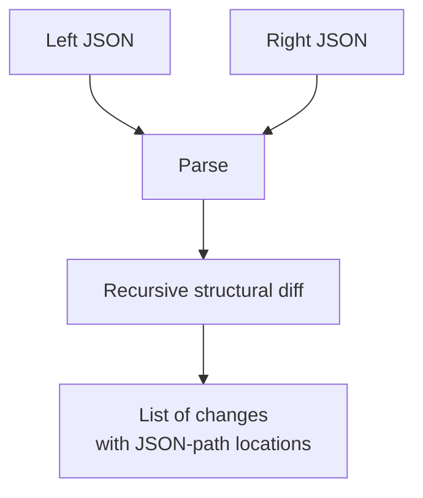

# JSON Diff

Compares two JSON documents and shows the structural differences — added, removed, and changed values — with their paths. Useful for debugging API responses, comparing configs, and spotting unintended changes.

## How It Works



The tool recursively walks both documents in parallel. For each path it detects:

| Change type | Meaning |
|-------------|---------|
| `added` | Key/element exists only in the right document |
| `removed` | Key/element exists only in the left document |
| `changed` | Both sides have a value, but they differ |

Paths use dot notation for object keys (`$.user.name`) and bracket notation for array indices (`$.items[2]`).

### Example

Left:
```json
{ "name": "Alice", "age": 30, "role": "admin" }
```

Right:
```json
{ "name": "Alice", "age": 31, "email": "a@x.com" }
```

Result:
- `$.age` — **changed** (30 → 31)
- `$.role` — **removed**
- `$.email` — **added**

## Best Practices

- **This is a structural diff**, not a text diff. Reordered object keys with the same values show no difference. If key order matters, use a text diff tool instead.
- **Arrays are compared by index** — element `[0]` on the left is compared to `[0]` on the right. If you insert an element at the beginning of an array, every subsequent element will show as "changed."
- **Both inputs must be valid JSON.** If either side fails to parse, you'll get a clear error message.

## Tips & Hints

- Use this before and after a migration to verify data integrity.
- The diff handles nested objects and arrays of any depth.
- `null` and `undefined` are treated as different types — `null` is valid JSON, `undefined` is not.
- Comparing large arrays (1000+ elements) works but produces many changes if items shift position.
