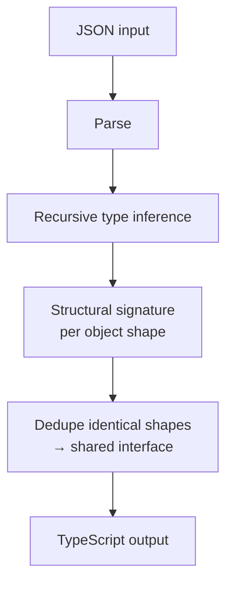

# JSON → TypeScript

Infers TypeScript type definitions from a JSON document. Generates clean `interface` and `type` declarations with proper naming, union types for mixed arrays, and structural deduplication.

## How It Works

The tool walks the JSON tree and infers the type of each value:

| JSON value | Inferred type |
|-----------|---------------|
| `string` | `string` |
| `number` | `number` |
| `boolean` | `boolean` |
| `null` | `null` |
| `[]` | `unknown[]` |
| `[1, 2]` | `number[]` |
| `[1, "a"]` | `(number \| string)[]` |
| `{...}` | Named `interface` |

### Smart features

- **Structural deduplication:** Objects with identical key/type signatures share a single interface. If two objects have the same shape, only one interface is generated.
- **Union types for mixed arrays:** An array containing numbers and strings becomes `(number | string)[]`.
- **Singular naming:** Array properties get singular type names (e.g., `items` → `Item[]`).
- **Reserved word handling:** Keys that are TypeScript reserved words (like `class`, `return`) are quoted. Type names derived from reserved words get a `_` suffix.
- **Non-identifier keys** are quoted automatically.

## Best Practices

- **Use representative data** — the inference is based on what it sees. If your API sometimes returns `null` for a field, include that case in your sample JSON.
- **Name your root type** using the root name field. Common choices: `User`, `Product`, `ApiResponse`.
- **Review the output** — inferred types are a starting point. You may want to tighten unions or add optional (`?`) markers for fields that aren't always present.
- **Empty arrays** infer as `unknown[]` because there's no element type to infer. Replace with the concrete type manually.

## Tips & Hints

- If the root JSON is an object, the tool emits an `interface`. If it's a primitive or array, it emits a `type` alias.
- Nested objects get their own interfaces, named after the property key in PascalCase.
- The tool handles deeply nested structures — there's no depth limit.
- Keys containing special characters (spaces, hyphens) are automatically quoted in the interface.
