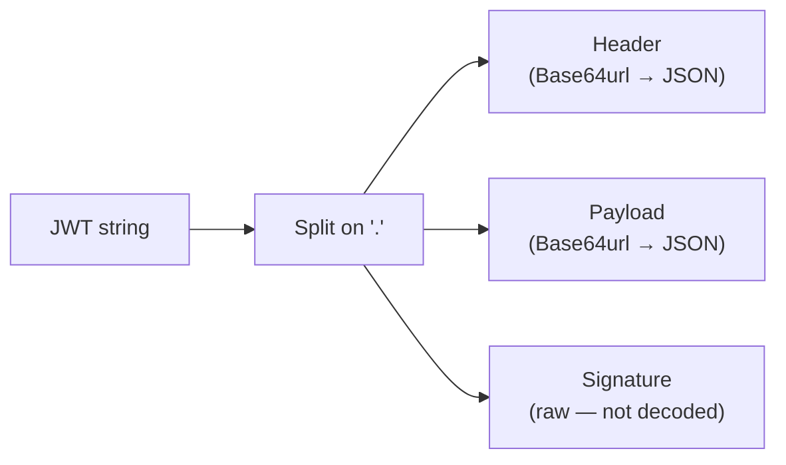

# JWT Parser

Decodes and inspects JSON Web Tokens (JWTs). Splits the token into its three parts — header, payload, and signature — and decodes the Base64url-encoded header and payload into readable JSON.

## How It Works

A JWT is three Base64url-encoded segments separated by dots:

```
eyJhbGciOi... . eyJzdWIi... . SflKxwRJ...
   header         payload      signature
```



The **header** describes the algorithm and token type. The **payload** carries claims (user ID, expiration, roles, etc.). The **signature** is the cryptographic proof that the sender holds the signing key — this tool shows it but does not verify it.

### Common claims

| Claim | Meaning |
|-------|---------|
| `iss` | Issuer — who created the token |
| `sub` | Subject — who the token is about (usually user ID) |
| `aud` | Audience — intended recipient |
| `exp` | Expiration time (Unix timestamp) |
| `nbf` | Not before — earliest valid time |
| `iat` | Issued at — creation timestamp |
| `jti` | Unique token ID |

## Best Practices

- **This tool decodes, it does not verify.** Anyone can create a JWT with any payload. Always verify the signature server-side using the signing key before trusting the claims.
- **Never put secrets in a JWT payload** — the payload is Base64url-encoded, not encrypted. Anyone who intercepts the token can read it.
- **Check `exp`** before trusting a token — expired tokens should be rejected.
- **Use short expiration times** (15–60 minutes) for access tokens and refresh tokens for longer sessions.

## Tips & Hints

- This tool runs **entirely in your browser** — tokens are never sent anywhere.
- The signature segment is shown as-is (not decoded) because it's a raw byte string, not JSON.
- If the token doesn't have exactly 3 dot-separated parts, the parser throws an error.
- Base64url uses `-` and `_` instead of `+` and `/`, and omits padding `=`. The parser handles this automatically.
- To check if a JWT is expired, look at the `exp` claim (Unix seconds) and compare to the current time.
