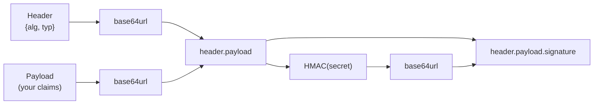

# JWT Signer

Mints and signs a JSON Web Token from a payload and an HMAC secret. The counterpart to the JWT Parser, which reads tokens rather than creating them.

## How It Works

The header and payload are base64url-encoded and joined with a dot; that string is signed with HMAC using your secret, and the signature is appended as a third segment.

### Registered claims

`iat` (issued at) is added automatically, and `exp` (expiry) when the expiry field is above zero. Both are **seconds** since the Unix epoch, not milliseconds — a common source of tokens that expire 50,000 years from now.

A payload that sets its own `iat` or `exp` keeps its value; the tool never overwrites what you supplied.

## Best Practices

- **Base64url is not encryption.** Anyone holding the token can read the payload — the signature proves it wasn't *altered*, not that it's *secret*. Never put passwords or personal data in a JWT.
- **Use a long, random secret.** HMAC security rests entirely on it; a dictionary word is brute-forceable offline by anyone who holds one token. The Token Generator produces suitable values.
- **Always set an expiry.** A token without `exp` is valid forever, which turns a single leak into permanent access.
- **Verify `alg` on the receiving end** against an allowlist. Accepting whatever the token claims is the classic JWT vulnerability — including `alg: none`.

## Tips & Hints

- Only HMAC algorithms (`HS256`, `HS384`, `HS512`) are supported. `RS*` and `ES*` sign with a private key, which is a different workflow — generate one with the RSA Key Pair Generator.
- The secret never leaves your device; signing happens entirely in the browser, and this tool's history is never written to disk.
- Paste the result into the JWT Parser to confirm the claims came out as intended.
- `HS256` is the sensible default. Longer digests don't meaningfully improve security here, since the secret is the weak point, not the hash.
