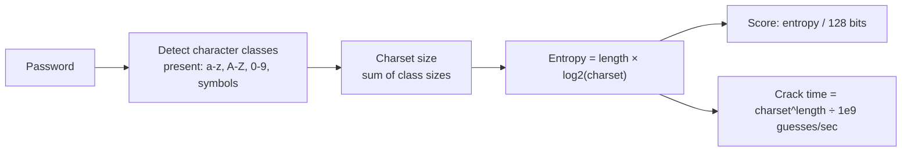

# Password Strength Analyser

Estimates entropy and brute-force crack time for a password, entirely in your browser. Nothing you type is ever stored or sent anywhere.

## How It Works

| Metric | Meaning |
|--------|---------|
| Character set size | Sum of the character classes actually used (lowercase 26, uppercase 26, digits 10, symbols 25) |
| Entropy | `length × log2(charsetSize)` — bits of randomness, assuming a fully random password |
| Score | Entropy scaled against a 128-bit ceiling (128 bits ≈ 100/100) |
| Duration to crack | `charsetSize^length` guesses divided by an assumed 1 billion guesses/sec |

## Assumptions and Limitations

This is a **brute-force estimate only** — it assumes an attacker has to try every possible combination, which is the best case for you and the worst case for the attacker. Real-world cracking is often much faster because of other technologies and techniques:

- **Dictionary attacks** try known words, leaked passwords, and common patterns (`Password1!`, `qwerty123`) first — these fall in milliseconds no matter how long they are, because they're not randomly generated.
- **Credential stuffing** replays passwords leaked from other breaches. If you reuse a password anywhere it's already been leaked, entropy is irrelevant.
- **Hardware matters a lot.** 1 billion guesses/sec is a rough single-GPU order of magnitude for a fast offline hash. A cluster of GPUs/ASICs, or a cloud-scale cracking rig, can push that several orders of magnitude higher; a slow, properly salted hash (bcrypt/scrypt/Argon2) can push it several orders of magnitude *lower*.
- **Online attacks** (guessing against a live login) are usually rate-limited by the service, so they're far slower than this offline estimate — but a data breach exposes the hash for unlimited offline attempts.

## Best Practices

- **Use a password manager** to generate and store long, random, unique passwords — see the Password Generator tool.
- **Length beats complexity.** A longer password with fewer character classes usually has more entropy than a short, "complex" one.
- **Never reuse passwords across sites** — one breach shouldn't compromise every account.
- **Enable multi-factor authentication** wherever it's offered; it protects you even if the password itself is guessed.

## Tips & Hints

- This tool runs **entirely in your browser** — the password is analysed locally and never leaves your machine (this tool never persists history, unlike most others in this app).
- A high score here doesn't guarantee safety — a long random-looking password that's actually a known leaked password is still weak.
