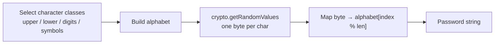

# Password Generator

Generates strong, cryptographically secure passwords using `crypto.getRandomValues`. You control the length and which character classes to include (uppercase, lowercase, digits, symbols).

## How It Works

Each character is chosen by mapping a cryptographically random byte to the combined alphabet. The result is a uniform random selection across all enabled character classes.

### Character classes

| Class | Characters |
|-------|-----------|
| Uppercase | `A-Z` (26) |
| Lowercase | `a-z` (26) |
| Digits | `0-9` (10) |
| Symbols | `!@#$%^&*()-_=+[]{};:,.<>?` (24) |

With all four classes enabled, the alphabet is 86 characters — roughly 6.4 bits of entropy per character.

### Entropy by length (all classes enabled)

| Length | Entropy | Strength |
|--------|---------|----------|
| 12 | ~77 bits | Good |
| 16 | ~102 bits | Strong |
| 20 | ~128 bits | Excellent |
| 32 | ~205 bits | Overkill for most uses |

## Best Practices

- **Length matters more than complexity.** A 20-character password with 3 character classes is stronger than a 12-character password with all 4.
- **Use at least 16 characters** for important accounts. 20+ is recommended for password-manager master passwords.
- **Don't reuse generated passwords** — generate a fresh one for each service.
- **Store passwords in a password manager** rather than trying to memorize them.
- At least one character class must be enabled — the generator throws an error if none are selected.

## Tips & Hints

- This tool runs **entirely in your browser** — passwords are never transmitted or stored.
- The generator does **not** guarantee at least one character from each enabled class (it's purely random). For a password policy requiring all classes, generate a few and pick one that satisfies the rule.
- Symbols are limited to a safe subset that works on most websites. If a site rejects certain symbols, disable the symbols class and lengthen the password instead.
