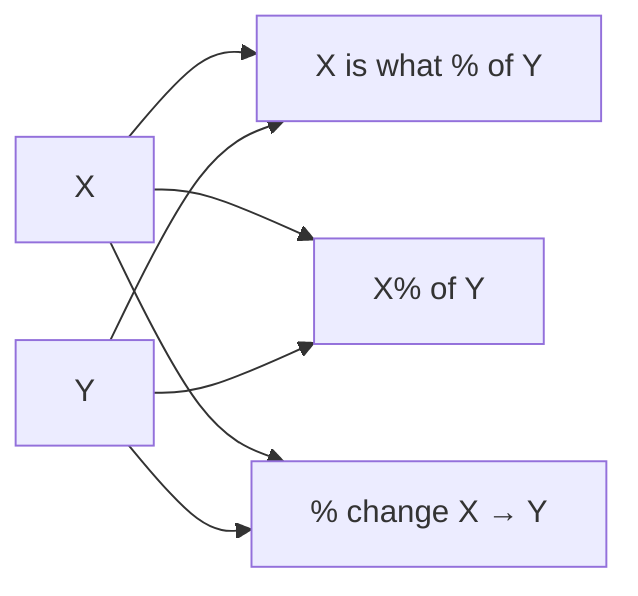

# Percentage Calculator

Every common percentage calculation in one tool. Enter two numbers (X and Y) and get all of them at once — read the row you need instead of remembering which formula goes which way round.

## How It Works

### The three calculations

| Calculation | Formula | Example (X=25, Y=200) |
|-------------|---------|----------------------|
| X is what % of Y | `(X / Y) × 100` | 25 is 12.5% of 200 |
| X% of Y | `(X / 100) × Y` | 25% of 200 = 50 |
| % change X → Y | `((Y - X) / \|X\|) × 100` | change from 25 → 200 = +700% |
| Y is what % of X | `(Y / X) × 100` | 200 is 800% of 25 |
| Difference (Y − X) | `Y - X` | 175 |
| X increased by Y% | `X × (1 + Y/100)` | 25 + 25% of 200 → 75 |
| X decreased by Y% | `X × (1 - Y/100)` | 25 − 25% of 200 → −25 |
| Ratio X : Y | both divided by their GCD | 25 : 200 → 1 : 8 |

### Percent change direction

The percent change formula measures the change **from X to Y**:
- Y > X → positive change (increase)
- Y < X → negative change (decrease)
- The absolute value of X is used in the denominator to handle negative starting values correctly

## Best Practices

- **Know which calculation you need** — "percent of" and "percent change" are different operations that people frequently confuse.
- **Percent change divides by the original value (X)**, not the new value (Y). "Going from 100 to 150 is a 50% increase" — `(150-100)/100 = 50%`. Not `(150-100)/150 = 33%`.
- **Avoid dividing by zero** — if X is 0, "X is what % of Y" and "% change" return 0 to avoid `NaN`.

## Tips & Hints

- Results are rounded to 2 decimal places.
- Percent change can exceed 100% (e.g., 10 → 100 is a 900% increase).
- A negative result for "% change" means Y is smaller than X (a decrease).
- "X% of Y" works with X > 100 — 150% of 200 = 300.
