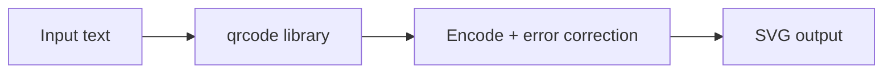

# QR Code Generator

Generates QR codes from text or URLs as downloadable SVG images. Uses the `qrcode` library with medium error correction.

## How It Works

QR codes encode data as a grid of black and white modules. The encoder:
1. Determines the **encoding mode** (numeric, alphanumeric, byte, Kanji) based on the input
2. Adds **error correction** data using Reed-Solomon codes
3. Places the data modules plus finder, alignment, and timing patterns into a matrix
4. Renders the matrix as an SVG

### Error correction levels

| Level | Recovery | Use when |
|-------|----------|----------|
| L (Low) | ~7% | Maximum data capacity, clean environment |
| M (Medium) | ~15% | **Default** — balanced |
| Q (Quartile) | ~25% | Some damage expected |
| H (High) | ~30% | Logos overlaid, harsh environments |

Higher error correction lets the code survive damage (dirt, partial obstruction, logo overlay) but increases the module count, making the code larger.

## Best Practices

- **Test before deploying** — always scan the generated QR code with a real device before printing or distributing it.
- **Keep the input short** — shorter data = fewer modules = easier to scan at small sizes. Use URL shorteners for long URLs.
- **SVG scales infinitely** — use SVG (not PNG) for print and responsive web. It stays crisp at any size.
- **Leave quiet zone margins** — the blank border around the code. This tool adds a 2-module margin, which meets the minimum spec.
- **Test on dark backgrounds** — QR scanners need contrast. White background + black modules is safest.

## Tips & Hints

- The output is SVG, so you can embed it directly in HTML with `` or save it as an `.svg` file.
- QR codes can encode up to ~2,953 bytes (byte mode, version 40, low error correction). But large codes are hard to scan — keep it under a few hundred characters.
- Special characters, emoji, and Unicode work fine — the encoder uses UTF-8 byte mode.
- For URLs, include the full scheme (`https://example.com`) so scanners open the browser automatically.
