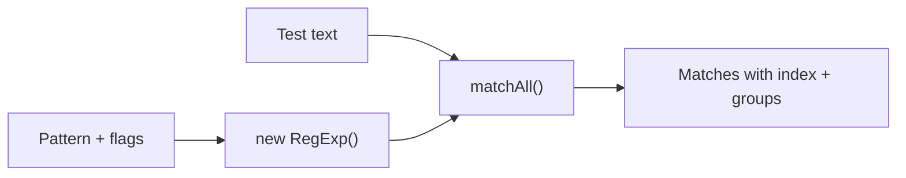

# Regex Tester

Tests regular expressions against text and shows all matches with their positions, captured groups, and total count. Useful for developing and debugging patterns before deploying them.

## How It Works

The tool uses `String.matchAll()` with the global (`g`) flag (added automatically if missing) to find every match in the input text. Each match reports:

| Field | Meaning |
|-------|---------|
| `match` | The full matched substring |
| `index` | Character offset where the match starts |
| `groups` | Capturing group values (if any) |

### Flags

| Flag | Effect |
|------|--------|
| `g` | Global — find all matches, not just the first (auto-added) |
| `i` | Case-insensitive |
| `m` | Multiline — `^` and `$` match line boundaries, not just string boundaries |
| `s` | Dotall — `.` matches newlines too |
| `u` | Unicode — treat patterns as UTF-16 code points |
| `y` | Sticky — match only at `lastIndex` |

## Best Practices

- **Escape special characters** when matching literal text: `.` `*` `+` `?` `(` `)` `[` `]` `{` `}` `^` `$` `|` `\`. Use `\.` to match a literal dot.
- **Prefer non-greedy quantifiers** (`.*?`) over greedy ones (`.*`) when you want the shortest match. Greedy `.*` can match too much and cause catastrophic backtracking.
- **Use character classes** (`[a-z]`) instead of `.` when you know the range — it's more precise and faster.
- **Avoid catastrophic backtracking** — nested quantifiers like `(a+)+` can cause exponential time on certain inputs. Use atomic groups or possessive quantifiers if your engine supports them.
- **Test with edge cases** — empty strings, strings with no match, strings with multiple matches, and strings with special characters.

## Tips & Hints

- The `g` flag is required for `matchAll()` and is added automatically if you forget it.
- Capturing groups are shown in the `groups` array. Named groups (`(?<name>...)`) appear as object properties.
- If your regex has a syntax error, the tool throws an error — check for unbalanced parentheses or brackets.
- Use `\d` for digits, `\w` for word characters, `\s` for whitespace. Their uppercase counterparts (`\D`, `\W`, `\S`) are the negation.
- To match a string that starts and ends with the same word: `\b(\w+)\s+\1\b` (backreference to group 1).
