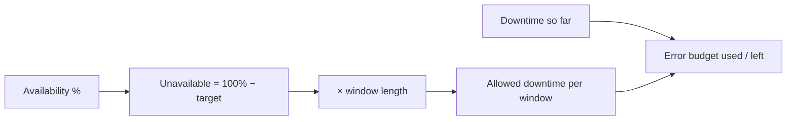

# Uptime / SLA Calculator

Turns an availability target ("99.9%") into the thing you actually need: how much downtime that allows, per day, week, month, quarter and year — and how much of that budget you have already spent.

## How It Works

## The Nines

| Target | Per day | Per month (30d) | Per year (365d) |
|--------|---------|-----------------|-----------------|
| 99% ("two nines") | 14m 24s | 7h 12m | 3d 15h |
| 99.9% ("three nines") | 1m 26s | 43m 12s | 8h 45m |
| 99.95% | 43s | 21m 36s | 4h 22m |
| 99.99% ("four nines") | 8.6s | 4m 19s | 52m 35s |
| 99.999% ("five nines") | 0.86s | 25.9s | 5m 15s |

Each extra nine costs 10× the downtime budget — and usually far more than 10× the engineering. Four nines means a bad deploy has to be detected and rolled back in under five minutes a month, every month.

## Error Budgets

The gap between 100% and your target *is* the budget. It is not a failure to spend it — it is the allowance that buys you deploys, migrations, and experiments.

- **Budget used** — downtime you've recorded against what the window allows.
- **Budget remaining** — what's left before the target is missed.
- **Status** — breached when recorded downtime exceeds the allowance.

The usual operating rule: while budget remains, ship. When it's exhausted, freeze risky changes and spend the time on reliability instead.

## Best Practices

- **Set the target from what users need**, not from what sounds impressive. Five nines on a batch reporting system is wasted money.
- **Your SLO should be stricter than your SLA** — the contract you sign should have slack against the target you operate to, so you find out before your customers invoice you.
- **A dependency caps you.** If your database is 99.9% and you call it on every request, your service cannot be 99.99% no matter how good your code is.
- **Measure downtime the way the contract does.** Full outage only, or degraded performance too? Whose clock? Per-region or global? These change the number more than any calculation here.

## Tips & Hints

- Months are 30 days and years 365 here — the convention most SLAs use. A contract measuring calendar months will differ by a few percent.
- Partial degradation is often counted as fractional downtime: 20 minutes at 50% error rate ≈ 10 minutes of budget.
- Planned maintenance is frequently excluded from an SLA but not from user experience. Track both.
- "Actual availability" reads your recorded downtime against the selected window, so you can compare it directly with the target.
