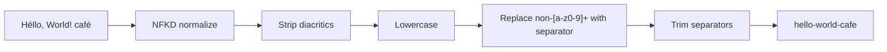

# Slugify

Converts text into URL-safe slugs. Strips diacritics, lowercases, replaces non-alphanumeric runs with a separator (default `-`), and trims leading/trailing separators.

## How It Works

### Step-by-step for `"Héllo, World! café"`

1. **NFKD normalize** — decomposes accented characters into base + combining marks (`é` → `e` + `◌́`)
2. **Strip combining marks** — removes the diacritical marks, leaving `Hello, World! cafe`
3. **Lowercase** → `hello, world! cafe`
4. **Replace non-alphanumeric runs** with `-` → `hello-world-cafe`
5. **Trim** leading/trailing separators

## Best Practices

- **Slugs should be stable** — once a URL is published, changing the slug breaks links. Generate it once and store it.
- **Use a consistent separator** — `-` is the most common and SEO-friendly. Avoid `_` which can be hidden by underline in URLs.
- **Slugs should be unique** — append a short ID or counter if two articles have the same title.
- **Keep slugs short** — long slugs are harder to read and share. Consider truncating to a reasonable length (50–80 chars).

## Tips & Hints

- You can change the separator to any character (e.g., `_` for snake_case slugs), including an empty one.
- **Case** can be `lower` (the default and the SEO norm), `upper`, or `preserve` for slugs used as identifiers rather than URLs.
- **Max length** truncates on a word boundary, so a capped slug never ends mid-word or on a stray separator. `0` means no limit.
- The tool handles Unicode normalization correctly — `ñ` becomes `n`, `ü` becomes `u`, `ß` stays `ss` (via NFKD).
- Emojis and other non-alphanumeric characters are replaced by the separator, not stripped — `"hello 🎉 world"` becomes `hello-world`.
- Text in a non-Latin script (Cyrillic, Greek, CJK, Arabic) has no ASCII to keep, so the tool reports an error rather than silently returning an empty slug. Transliterate first if you need one.
