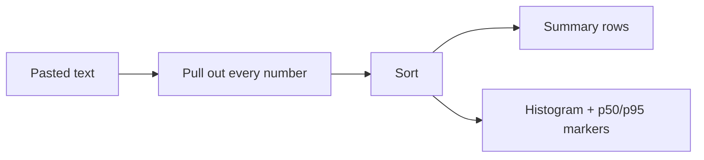

# Number Statistics

Paste a column of numbers — latencies, response sizes, build times, anything — and get the whole summary at once: mean, median, percentiles, spread, and a histogram of the distribution.

## How It Works

Input parsing is deliberately forgiving: every number in the text is extracted and everything else ignored. A comma-separated list, one value per line, a pasted spreadsheet column, or a raw log excerpt all work without cleaning them up first.

## Why the Median and Mean Differ

| Statistic | Answers | Fooled by |
|-----------|---------|-----------|
| Mean | "What is the total, spread evenly?" | A single huge outlier |
| Median (p50) | "What does the typical case look like?" | Nothing much — it's robust |
| p95 / p99 | "How bad is the bad case?" | Too few samples |

If mean ≫ median, the data has a long right tail — a few slow requests dragging the average up. That gap is the whole reason percentiles exist, and it's why an average latency dashboard hides the users who are actually suffering.

### Percentiles

`p95 = 240ms` means 95% of values are at or below 240ms and 5% are worse. Percentiles here use **linear interpolation** between the two neighbouring values (the numpy / R-7 default, and what most monitoring systems use). With few samples the interpolation matters: p99 of 10 values is mostly a statement about your largest value.

### Spread

| Row | Meaning |
|-----|---------|
| Std deviation | Typical distance from the mean, in the same units as the data |
| Variance | Std deviation squared — the raw form, useful for further maths |
| Interquartile range | Width of the middle 50% (p75 − p25), ignores both tails |
| Coefficient of variation | Std deviation as a % of the mean — compares volatility across different scales |
| Outliers | Count of values beyond 1.5× the IQR from the quartiles (Tukey's rule) |

Standard deviation is the **sample** form (dividing by n−1), which is the right choice when the numbers are a sample of a larger population — nearly always the case for measurements.

## Reading the Histogram

Bars show how many values fall in each range. Two dashed markers sit where p50 and p95 actually land, and bars past p95 are coloured as the tail.

- **One hump, markers close together** — consistent behaviour.
- **Long flat tail to the right** — a slow path that only some requests hit.
- **Two separate humps** — two populations mixed together (cache hit vs miss, two regions, two code paths). Split them before averaging; a single mean describes neither.

## Best Practices

- **Report p95/p99, not the mean**, for anything a user waits on.
- **Check the count** — p99 of 50 samples is noise. You want hundreds before p99 means anything.
- **Don't average percentiles** across time buckets or servers. The average of two p95s is not the p95 of the whole; re-compute from raw values.

## Tips & Hints

- Negative numbers, decimals, and scientific notation (`3e2`) all parse.
- Click any row to copy just that value.
- Values are counted in the order found, but the summary is order-independent — sorting your input first changes nothing.
