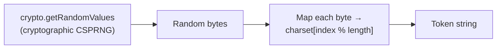

# Token Generator

Generates cryptographically secure random tokens for API keys, session secrets, CSRF tokens, and other bearer credentials. All entropy comes from `crypto.getRandomValues` — never `Math.random`.

## How It Works

Each random byte (0–255) is mapped to a character from the chosen alphabet via modulo. Because the byte range (256) isn't evenly divisible by most alphabet sizes, there's a tiny modular bias — negligible for practical token lengths but worth knowing.

### Charsets

| Charset | Alphabet | Typical use |
|---------|----------|-------------|
| `hex` | `0-9a-f` | API keys, opaque tokens (4 bits/char) |
| `base64url` | `A-Za-z0-9-_` | JWTs, URL-safe tokens (6 bits/char) |
| `alphanumeric` | `A-Za-z0-9` | Short codes, referral IDs (≈5.9 bits/char) |

### Entropy by length

| Length | hex entropy | base64url entropy |
|--------|-------------|-------------------|
| 16 | 64 bits | 96 bits |
| 32 | 128 bits | 192 bits |
| 64 | 256 bits | 384 bits |

A 128-bit token (32 hex chars or 22 base64url chars) provides collision resistance comparable to a UUID v4.

## Best Practices

- **Use at least 128 bits of entropy** (32 hex chars, 22 base64url chars) for session tokens. For long-lived API keys, use 256 bits.
- **Prefer `hex` or `base64url`** for security tokens — they're easy to copy and URL-safe.
- **Store tokens hashed** in your database (like passwords). Compare by hashing the submitted token and checking the hash.
- **Never log tokens** or put them in URLs that get logged by proxies.

## Tips & Hints

- This tool runs **entirely in your browser** — generated tokens never leave your machine.
- For bearer tokens, `base64url` gives you more entropy per character than `hex`, so shorter strings are equally secure.
- A 32-character hex token has the same collision space as a UUID v4 but is more compact to transmit.
