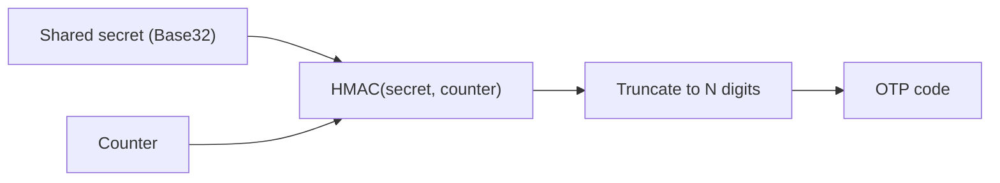
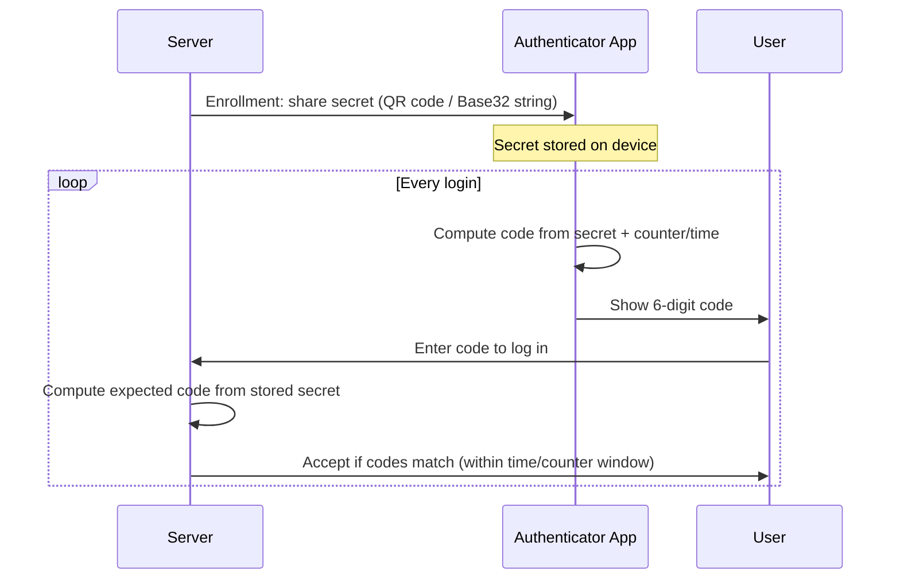

# TOTP / HOTP Generator

Generates **one-time passcodes (OTPs)** — the 6–8 digit codes used for two-factor authentication (2FA) — from a shared secret. Lets you test a 2FA flow, verify a backend implementation, or read a code without reaching for your phone.

Both algorithms are defined by open standards and share the same core: an **HMAC** of a counter, truncated down to a short decimal code.

- **TOTP** (RFC 6238) — Time-based OTP. The counter is the current time, so the code rolls over automatically (usually every 30s).
- **HOTP** (RFC 4226) — Counter-based OTP. The counter is an explicit number that increments by one each time a code is used.

---

## How It Works



```
HOTP(K, C) = Truncate(HMAC-SHA-1(K, C))
TOTP(K)    = HOTP(K, floor(unixTime / period))
```

- **K** — the shared secret, Base32-encoded (the string an app shows you, or hides behind a QR code, when you enable 2FA).
- **C** — an 8-byte counter. For HOTP it's a number you (and the server) both track and increment. For TOTP it's derived from the clock, so both sides just need synchronized time.
- **Truncate** — RFC 4226's "dynamic truncation": take 4 bytes from the HMAC output at an offset given by its last nibble, mask off the top bit, and reduce mod 10^digits.

Because truncation is deterministic, the same secret and counter always produce the same code — which is exactly what lets a server compute the expected code independently and compare it to what the user typed.

---

## Typical Authentication Flow



The secret is exchanged **once**, at enrollment. After that, the server and the authenticator app independently compute the same code from the same secret — nothing else needs to be transmitted, which is what makes this work without a network round-trip to the app.

---

## TOTP vs HOTP

| | TOTP | HOTP |
|---|------|------|
| Counter source | Current time (`floor(time / period)`) | Explicit, incremented by 1 per use |
| Needs | Synchronized clocks (server & client) | Synchronized counter state |
| Code lifetime | Expires every period (usually 30s) | Valid until used, no time limit |
| Common use | Google Authenticator, Authy, most app 2FA | Hardware tokens (e.g. early YubiKey OTP), some banking tokens |
| Failure mode | Clock drift → codes rejected | Counter desync (e.g. user generates codes without using them) → server checks a small look-ahead window |
| Adoption today | Dominant for app-based 2FA | Less common — mostly legacy/hardware tokens |

Both reduce to the same primitive (`HOTP(K, C)`); TOTP is just HOTP with time standing in for a hand-tracked counter, which is why it needs no state beyond the clock.

---

## Common Uses

- Testing a 2FA login flow during development, without needing your phone.
- Verifying a backend TOTP/HOTP implementation against known values.
- Recovering access to a test/staging account when the authenticator app isn't handy.
- Checking that a secret decodes correctly before provisioning it in an app.
- Debugging "invalid code" issues by comparing generated codes and counters directly.

---

## Fields

| Field | Meaning |
|-------|---------|
| **Mode** | TOTP (time-based) or HOTP (counter-based). |
| **Base32 secret** | The shared secret, Base32-encoded — the format every authenticator app expects (e.g. `JBSWY3DPEHPK3PXP`). |
| **Algorithm** | The HMAC hash function: SHA-1 (default, universally supported), SHA-256, or SHA-512. |
| **Digits** | Code length: 6 (standard) or 8. |
| **Period (s)** | TOTP only — how many seconds each code is valid for. 30s is the near-universal default. |
| **Counter** | HOTP only — the explicit counter value for this code. |

---

## Security Notes

- **This tool runs entirely in your browser.** The secret and generated codes are never sent anywhere, and history is never persisted for this tool.
- A TOTP/HOTP secret **is** the credential — anyone who has it can generate valid codes indefinitely. Treat it like a password, not like the 6-digit code itself.
- SHA-1 remains the de facto standard for TOTP (that's what virtually every authenticator app assumes) despite SHA-1 being weak for collision resistance elsewhere — HMAC-SHA-1's security doesn't rely on SHA-1's collision resistance, so this is still considered acceptable for OTP use.
- TOTP verification should accept a small window of adjacent time steps (e.g. ±1) to tolerate clock drift, but a wider window trades security margin for convenience.
- HOTP verification should accept a small look-ahead window of counters, since a user can generate codes without submitting them (e.g. pressing a hardware token's button by accident) and desync the counter.
- 2FA using OTP codes protects against stolen passwords, not against phishing — a fake login page can relay a valid code to the real site in real time. Where possible, prefer phishing-resistant methods (e.g. WebAuthn/passkeys) for high-value accounts.

---

## Frequently Asked Questions

### Why does my code not match my authenticator app?

Check that the secret, algorithm, digit count, and period all match what the app is using — nearly all apps default to SHA-1, 6 digits, 30s, but a service can configure otherwise. For TOTP, also check your system clock; drift of more than a period or two will produce a different code.

### Can I recover the secret from a code?

No. HMAC is a one-way function — the code reveals nothing about the secret it came from.

### What's the Base32 secret format?

It's the standard encoding for OTP secrets (RFC 4648 Base32, no lowercase, alphabet `A–Z2–7`). It's what's embedded in the `otpauth://` URI behind a 2FA enrollment QR code and what apps show you as a fallback when you can't scan it.
