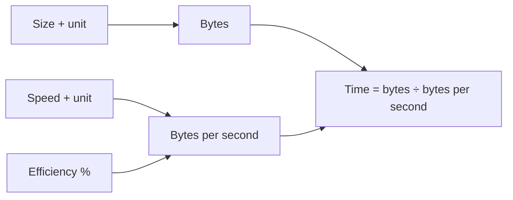

# Transfer Time Calculator

How long does 5 GB take over a 100 Mbps link? This answers that, in both directions of the units people quote — and shows the same file at four common line speeds so you can see what a faster pipe would actually buy.

## How It Works

## Bits vs Bytes — the Whole Problem

Network speeds are quoted in **bits** per second. File sizes are in **bytes**. Eight bits to a byte, so:

| Line speed | Bytes per second | 1 GB takes |
|------------|------------------|------------|
| 10 Mbps | 1.25 MB/s | ~13m 20s |
| 100 Mbps | 12.5 MB/s | ~1m 20s |
| 1 Gbps | 125 MB/s | ~8s |
| 10 Gbps | 1.25 GB/s | ~0.8s |

A "100 Mbps" connection downloads at about 12.5 MB/s. That's not your ISP cheating — it's the units. Lowercase `b` is bits, uppercase `B` is bytes, and the difference is a factor of eight.

Both are decimal here: 1 Mbps is exactly 1,000,000 bits/s, and 1 GB is 10⁹ bytes — the convention for networking and storage alike. (Memory is the binary one; see the Byte Converter.)

## Efficiency

Nothing transfers at line rate. The efficiency percentage scales the speed down to something realistic:

| Setting | Roughly models |
|---------|----------------|
| 90–95% | Local wired LAN, large sequential file |
| 60–80% | Typical internet transfer over TCP, some contention |
| 30–50% | High latency or lossy link, small files, shared connection |

What eats the difference: TCP/IP header overhead (~3–5%), the slow-start ramp on short transfers, round-trip latency capping throughput regardless of bandwidth, retransmissions, and everyone else sharing the link.

## Best Practices

- **The bottleneck is the slowest hop**, not the one you're paying for. A 1 Gbps uplink into a 50 Mbps server is a 50 Mbps transfer.
- **Latency caps throughput on long links.** Over a high-latency path, TCP window size — not bandwidth — sets the ceiling. Doubling bandwidth on a transatlantic hop may change nothing.
- **Many small files are far slower** than one large file of the same total size. Per-file overhead dominates; archive first.
- **Check upload separately.** Consumer connections are asymmetric, often 10:1, and backups go the slow way.

## Tips & Hints

- The "At 10 Mbps / 100 Mbps / 1 Gbps / 10 Gbps" rows apply the same efficiency setting, so the comparison stays fair.
- For a transfer already in progress with a known amount done, use the ETA Calculator instead — it measures the rate you're actually getting rather than assuming one.
- Sanity check: divide Mbps by 8 for MB/s, then divide the size in MB by that. 5 GB over 100 Mbps ≈ 5000 ÷ 12.5 ≈ 400 seconds.
