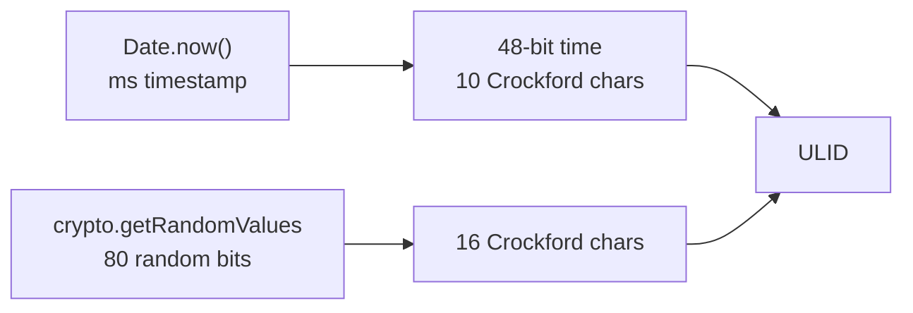

# ULID Generator

Generates Universally Unique Lexicographically Sortable Identifiers (ULIDs). A ULID combines a 48-bit Unix millisecond timestamp with 80 bits of cryptographically secure randomness, producing an ID that sorts chronologically and is URL-safe.

## How It Works

A ULID is 26 characters of Crockford Base32 and encodes 128 bits total:

```
01ARZ3NDEKTSV4RRFFQ69G5FAV
└── timestamp ──┘└── random ──┘
   10 chars         16 chars
   48 bits          80 bits
```



The timestamp prefix means ULIDs generated close together in time share a prefix and **sort lexicographically** in the same order they were created — even when stored as strings.

### Crockford Base32

Uses the alphabet `0123456789ABCDEFGHJKMNPQRSTVWXYZ` — no `I`, `L`, `O`, or `U` to avoid confusion with `1`, `l`, `0`, and `V`. This makes ULIDs safe to read aloud and type.

## Best Practices

- **Prefer ULIDs over UUID v1** when you need sortability without leaking a machine identifier — ULIDs reveal only the millisecond timestamp, not a node address.
- **Use ULIDs as database primary keys** — their monotonic-ish nature reduces B-tree page splits compared to random UUIDs.
- **ULIDs are not guaranteed monotonic** across processes or machines. Within a single process, same-millisecond IDs sort by their random portion, which is random — not incremental.

## Tips & Hints

- ULIDs are case-insensitive by spec. Convention is uppercase.
- Two ULIDs generated in the same millisecond differ only in the 16-character random suffix.
- The maximum timestamp representable is `7ZZZZZZZZZ` (the year 10889 AD) — effectively unlimited.
- Unlike UUIDs, ULIDs don't carry version/variant bits, so all 128 bits carry meaningful data.
