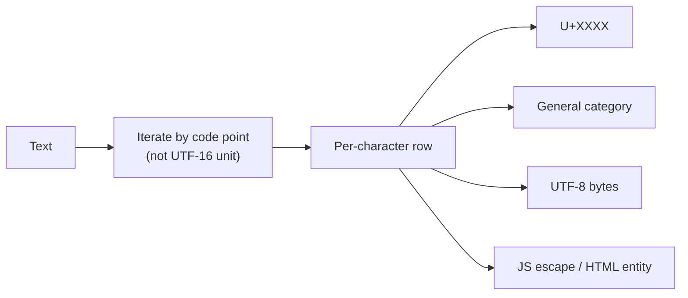

# Unicode Inspector

Breaks text into individual code points, showing what each one is and how it encodes. Use it when a string is behaving strangely — breaking a length limit, failing a regex, or rendering as boxes.

## How It Works

Iteration is by **code point**, not UTF-16 code unit. An emoji shows as one row rather than two meaningless surrogate halves — which is exactly the distinction that makes `"😀".length === 2` in JavaScript.

### Columns

| Column | Example | Meaning |
|--------|---------|---------|
| Code point | `U+1F600` | The Unicode scalar value |
| Glyph | `😀` | The rendered character (`·` for invisible controls) |
| Category | `Symbol` | Unicode general category |
| UTF-8 | `F0 9F 98 80` | Bytes on the wire |
| JS escape | `\u{1F600}` | Paste-able into source |
| HTML entity | `&#128512;` | Numeric character reference |

## Best Practices

- **Count code points, not `.length`, when a limit matters.** JavaScript's `.length` counts UTF-16 units, so astral characters count double.
- **Suspect invisible characters when a comparison fails unexpectedly** — zero-width spaces, non-breaking spaces, and BOMs all look like nothing but break equality.
- **Check the category when a regex misbehaves.** `\w` and `\d` are ASCII-only by default; a "digit" from another script won't match.

## Tips & Hints

- Control and format characters have no glyph, so they're shown as `·` — a blank column would look like a rendering bug rather than a finding.
- A non-breaking space (`U+00A0`) is the single most common invisible troublemaker in text pasted from a browser or word processor.
- Character *names* (like "GRINNING FACE") aren't shown: no JavaScript runtime ships the Unicode name database, and bundling ~40,000 names isn't worth the download.
- To work with the raw bytes instead of the characters, use the Hex / Binary Converter.
