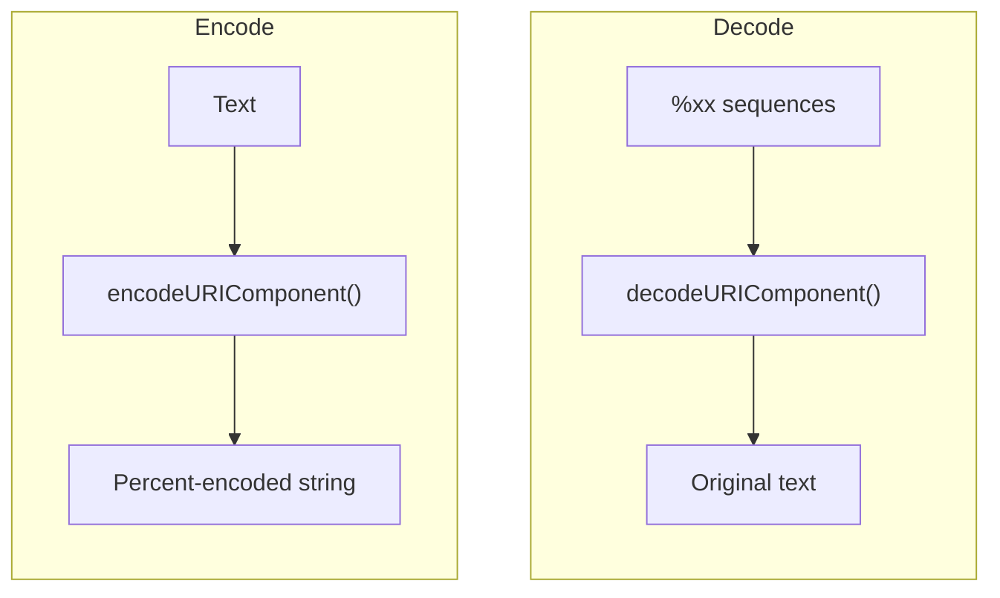

# URL Encoder

Encodes and decodes URL components using `encodeURIComponent` / `decodeURIComponent`. Escapes characters that have special meaning in URLs so they can be safely embedded as query parameters, path segments, or form data.

## How It Works

`encodeURIComponent` escapes everything except `A-Za-z0-9-_.!~*'()`. Spaces become `%20`, `&` becomes `%26`, `=` becomes `%3D`, and so on.

### `encodeURIComponent` vs `encodeURI`

| Target | Function | Leaves unescaped | Use for |
|--------|----------|-----------------|---------|
| `component` | `encodeURIComponent` | `A-Za-z0-9-_.!~*'()` | Query params, path segments — the default |
| `full-uri` | `encodeURI` | Also `;/?:@&=+$,#` | A complete URL, where the structural characters must survive |
| `form` | `encodeURIComponent` + form rules | `A-Za-z0-9-_.` | `application/x-www-form-urlencoded` bodies |

Pick `component` unless you know otherwise: it's the right choice for encoding individual values you're inserting into a URL. `full-uri` deliberately does **not** escape `&` or `=`, so running a value through it will corrupt the query string it lands in.

### Form encoding

`form` is what an HTML form sends and what `URLSearchParams` produces: spaces become `+`, and `!'()*~` are escaped too (`encodeURIComponent` leaves those alone). Decoding in `form` mode treats `+` as a space; in the other modes a `+` stays a literal plus, which is the difference that silently corrupts values when you decode with the wrong one.

## Best Practices

- **Always encode user-generated content** before placing it in a URL — unescaped `&`, `=`, `#`, or `?` will corrupt the URL structure.
- **Encode each parameter value separately**, not the whole query string. Build `?key=value&key2=value2` by encoding only the values.
- **Don't double-encode.** If a value is already percent-encoded, encoding it again produces `%2520` instead of `%20`.
- **Decode exactly once** when reading values back.

## Tips & Hints

- In `component` and `full-uri`, spaces encode as `%20`; only `form` uses `+`.
- Unicode characters are encoded as UTF-8 byte sequences: `é` → `%C3%A9`, `😀` → `%F0%9F%98%80`. The byte count next to the panel shows the real wire size.
- Decoding an invalid `%` sequence (like `%zz`) is an error — the input must be well-formed.
- **Swap** feeds the output back into the input with the mode flipped, so you can check a round-trip without copy-pasting.
