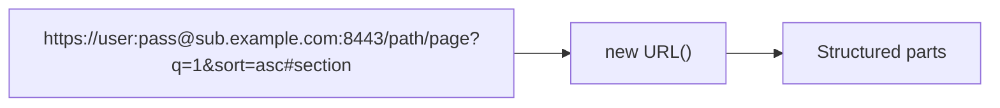

# URL Parser

Breaks a URL into its component parts using the browser's native `URL` API. Shows the protocol, host, hostname, port, pathname, hash, and parsed query parameters.

## How It Works

For a URL like `https://sub.example.com:8443/path/page?q=1&sort=asc#section`:

| Field | Value |
|-------|-------|
| `protocol` | `https:` |
| `host` | `sub.example.com:8443` |
| `hostname` | `sub.example.com` |
| `port` | `8443` |
| `pathname` | `/path/page` |
| `hash` | `#section` |
| `query` | `{ q: "1", sort: "asc" }` |

### `host` vs `hostname`

`host` includes the port (when non-default), `hostname` does not. For `https://example.com` they're identical; for `https://example.com:8080` they differ.

## Best Practices

- **Always use the `URL` API** (or a library) to parse URLs — don't use regex. URLs have many edge cases (IPv6 brackets, encoded characters, default ports) that regex gets wrong.
- **Query parameters are decoded automatically** — `%20` becomes a space, `%26` becomes `&`. You don't need to decode them again.
- **Relative URLs need a base.** The `URL` constructor requires an absolute URL. For relative URLs like `/api/users`, provide a base: `new URL('/api/users', 'https://example.com')`.

## Tips & Hints

- **A missing scheme is assumed to be `https`** — pasting `example.com/p?a=1` works. A scheme is only recognised when followed by `//` (or for the slash-less schemes `mailto:`, `tel:`, `data:`, `urn:`, `sms:`), because `new URL()` otherwise reads `example.com:8443/p` as the scheme `example.com:` with the path `8443/p`.
- **The port row shows the default** (80 for HTTP, 443 for HTTPS) when the URL omits it, rather than going blank.
- **Repeated query keys are numbered** — `?tag=a&tag=b` shows as `?tag [1]` and `?tag [2]`. In code, `URLSearchParams.get()` returns only the first; use `getAll()`.
- Every row copies its value on click.
- Host-less URLs (`mailto:you@example.com`) drop the origin/hostname rows — those parts genuinely don't exist.
