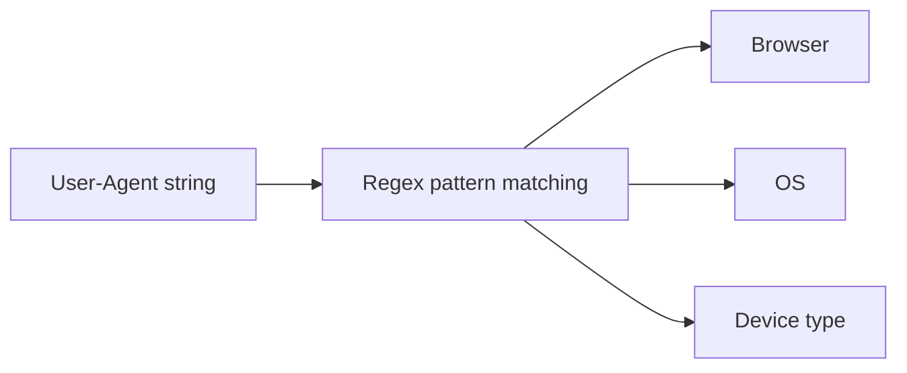

# User-Agent Parser

Parses a User-Agent string and identifies the browser, operating system, and device type. Uses pattern matching against known User-Agent signatures.

## How It Works

The parser checks for known browser signatures in priority order (Edge → Opera → Chrome → Firefox → Safari) since browsers often impersonate each other in their User-Agent strings. For example, Edge's UA contains both `Chrome/` and `Edg/`, so Edge must be checked first.

### Detection logic

| Property | Detection |
|----------|-----------|
| Browser | Checks for `Edg/`, `OPR/`, `SamsungBrowser/`, `Chrome/`, `Firefox/`, `Version/…Safari` in order, and captures the version number that follows |
| Engine | Derived from the browser: Blink (Edge/Opera/Samsung/Chrome), Gecko (Firefox), WebKit (Safari) |
| OS | `Windows NT`, `Android`, `iPhone/CPU OS`, `Mac OS X`, `CrOS`, `Linux` — with the version, where the UA carries one |
| Device | `Mobile`, `Tablet`, `Desktop`, or `Bot / HTTP client` |
| Bot | Flags `bot`, `crawler`, `spider`, `slurp`, `curl`, `wget`, `python-requests`, `okhttp`, `postman`, `insomnia`, `headless` |

## Best Practices

- **User-Agent parsing is inherently fragile.** Browsers change their UA strings frequently, and some allow users to spoof them. Don't rely on UA parsing for security or feature gating.
- **Prefer feature detection** over UA sniffing when possible — check `if ('serviceWorker' in navigator)` rather than detecting "Chrome."
- **Use a dedicated library** (like `ua-parser-js`) for production UA parsing — it handles more edge cases and is updated regularly as new browsers ship.
- **For analytics**, accept that results are approximate. A percentage of UAs will be unidentifiable or spoofed.

## Tips & Hints

- **The box starts filled with this device's own User-Agent**, so "what am I sending?" needs no lookup site. Clear it and paste any other UA to compare.
- **`Windows NT 10.0` covers both Windows 10 and 11** — Microsoft never bumped the NT version, so no parser can tell them apart from the UA alone.
- Safari's real version comes from the `Version/` token, not `Safari/` — the latter is a fixed WebKit build number (`537.36`) that every Chromium browser also carries.
- Chrome's UA contains `Safari/` (for historical compatibility), so Safari must be checked *after* Chrome.
- The parser identifies Edge via `Edg/` (the new Chromium-based Edge), not `Edge/` (legacy EdgeHTML).
- "Unknown" results usually mean either a bot/crawler, a non-browser HTTP client, or a browser with a reduced User-Agent string.
- iPad UA strings may report as `Mac OS X` since iPadOS 13 (Apple switched to desktop-class UA). The device will show as "Desktop" in that case.
