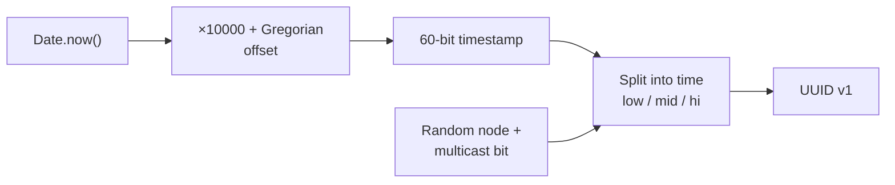
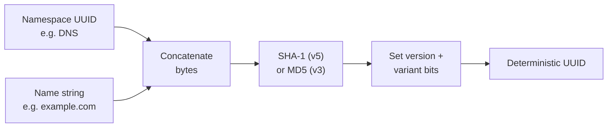
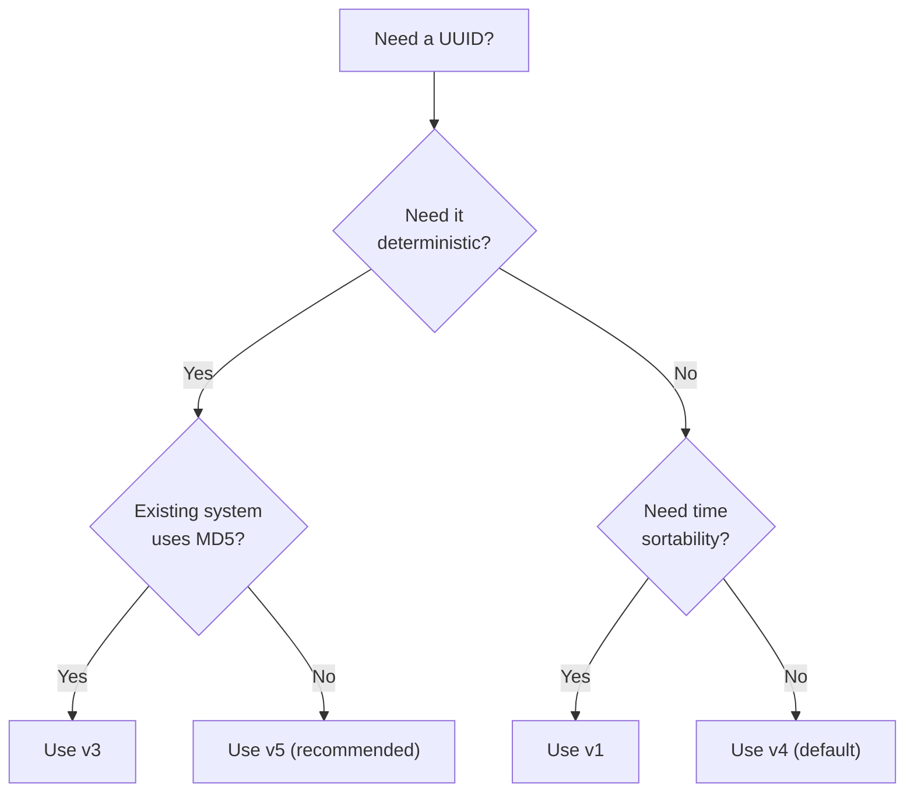

# UUID Generator

Generates RFC 4122 universally unique identifiers in four versions — v1, v3, v4, and v5. Each version uses a different strategy to guarantee uniqueness, with trade-offs between randomness, determinism, and sortability.

## How It Works

A UUID is a 128-bit value rendered as five hex groups separated by hyphens:

```
xxxxxxxx-xxxx-Mxxx-Nxxx-xxxxxxxxxxxx
│────────────│────│────│────────────│
   Timestamp   Ver  Var    Random
```

| Segment | Example | Description |
|---------|---------|-------------|
| `xxxxxxxx-xxxx` | `018f2c4d-ab12` | Timestamp (UUID v7) |
| `Mxxx` | `7abc` | Version (`M` = `7`) |
| `Nxxx` | `8def` | Variant (`N` = RFC 4122 variant) |
| `xxxxxxxxxxxx` | `123456789abc` | Random bits |

The `M` nibble encodes the **version** (1–5) and the `N` nibble encodes the **variant** (always `8`–`b` for RFC 4122). The remaining bits carry the version-specific data.

### Version 1 — Time-based

Combines the current **Gregorian timestamp** (counted in 100-nanosecond intervals since 1582-10-15) with a randomly generated **node** identifier. A 14-bit **clock sequence** is incremented on each call within a batch so multiple UUIDs generated in the same tick remain distinct.



- **Pros:** Sortable by generation time. Useful for database keys and event logs.
- **Cons:** The node bits can leak the machine's MAC address. This implementation uses a **random multicast node** instead of a real MAC, avoiding that leak. Timestamps reveal *when* the UUID was created — avoid v1 if that's sensitive.

### Version 3 — Name-based (MD5)

Hashes a **namespace UUID** + a **name string** with MD5, then sets the version/variant bits. The same namespace + name always produces the same UUID.

- **Pros:** Fully deterministic — great for generating stable IDs from known inputs (e.g., "user:42" → same UUID everywhere).
- **Cons:** MD5 is cryptographically broken. Prefer **v5** (SHA-1) unless you need v3 for backwards compatibility with an existing system.

### Version 4 — Random

Fills 122 bits with cryptographically secure random data (`crypto.randomUUID`). Only the version and variant nibbles are fixed.

- **Pros:** Zero coordination needed. No leaked metadata. The default for most use cases.
- **Cons:** Not sortable. Collisions are astronomically unlikely (probability ≈ 2⁻¹²² per pair) but theoretically possible.

### Version 5 — Name-based (SHA-1)

Same as v3 but uses **SHA-1** instead of MD5. Stronger hash, still deterministic.



- **Pros:** Deterministic + collision-resistant. The recommended choice when you need reproducible IDs.
- **Cons:** Same input → same UUID (by design). Not suitable when you need unpredictability.

### Predefined Namespaces (v3 / v5)

| Namespace | UUID | Use when the name is… |
|-----------|------|----------------------|
| DNS | `6ba7b810-…` | a fully-qualified domain name |
| URL | `6ba7b811-…` | a uniform resource locator |
| OID | `6ba7b812-…` | an ISO object identifier |
| X500 | `6ba7b814-…` | an X.500 distinguished name |

You can also use your own namespace UUID — just generate a v4 UUID once and reuse it as your namespace.

## Choosing a Version



## Best Practices

- **Default to v4** for general-purpose unique IDs — it's stateless and leaks nothing.
- **Use v5** when the same logical entity must map to the same UUID across systems (e.g., content-addressed storage, deduplication keys).
- **Avoid v1** if timestamp or node leakage is a concern. If you need sortability without leakage, consider ULIDs instead.
- **Never use v3** in new systems unless interoperating with an existing v3 consumer.
- **Store UUIDs as-is** (strings) or as 16-byte binary in databases. Don't strip hyphens and store as a bigint — you'll lose the variant/version semantics.

## Tips & Hints

- Generating **multiple** v3/v5 UUIDs with the same namespace + name returns identical copies — this is by design, not a bug.
- v1 UUIDs generated in a tight batch share the same node and timestamp; only the clock sequence differs. They sort correctly but look similar.
- A valid RFC 4122 UUID always has `8`, `9`, `a`, or `b` as the first digit of the third group (the variant nibble). If it starts with anything else, it's non-standard.
- The `xxxxxxxx-xxxx-4xxx-yxxx-xxxxxxxxxxxx` pattern (where `y` ∈ `8`–`b`) is the signature of a v4 UUID.
- UUIDs are case-insensitive — lowercase is conventional but not required.
