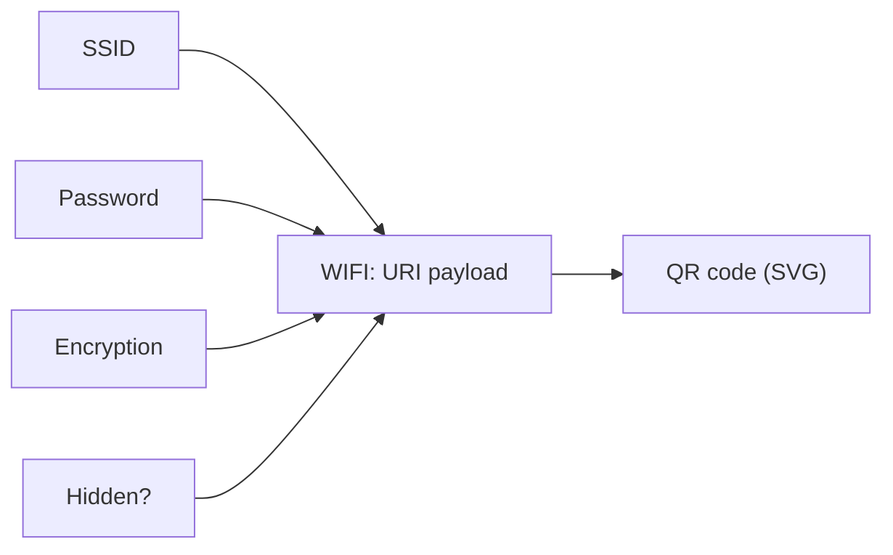

# WiFi QR Generator

Generates QR codes that let mobile devices join a WiFi network by scanning. Builds a `WIFI:` URI string from the SSID, password, encryption type, and hidden-network flag, then encodes it as an SVG QR code.

## How It Works



The generated payload follows the `WIFI:` URI scheme:

```
WIFI:T:WPA;S:MyNetwork;P:secretpass;;
```

| Field | Code | Meaning |
|-------|------|---------|
| `T` | `WPA` / `WEP` / `nopass` | Encryption type |
| `S` | SSID | Network name |
| `P` | Password | Pre-shared key (omitted if `nopass`) |
| `H` | `true` | Hidden network (optional) |

Special characters in the SSID or password (`\ ; , : "`) are backslash-escaped per the spec.

### How to scan

- **iOS:** Open Camera app, point at the QR code, tap the notification banner.
- **Android:** Open Camera or Google Lens, point at the code, tap the network prompt.
- **Both:** The phone shows the network name and asks to join. No need to type the password.

## Best Practices

- **Print on a stable surface** — QR codes on curved or reflective surfaces are hard to scan.
- **Don't share the QR code publicly** — it contains your WiFi password in scannable form. Treat it like writing your password on a sign.
- **Use WPA/WPA2/WPA3** — WEP is broken and should not be used. Most modern routers use WPA.
- **Test after printing** — always scan the printed code with at least one real device before relying on it.

## Tips & Hints

- For open networks (no password), select `nopass` as the encryption type — the password field is ignored.
- If your SSID contains special characters (spaces are fine), they're automatically escaped in the payload.
- The `hidden` flag tells the phone to broadcast a probe request for the SSID. Only check it if your network is actually hidden — it slows down scanning otherwise.
- The QR code encodes the password in plaintext — anyone who scans it (or photographs it) can read it. Position it where only intended users can see it.
